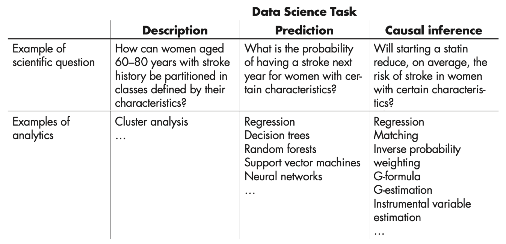

# Scientific inference

This is a lightly edited and annotated version of a transcript generated
from the lecture on September 1st, 2025. The transcript is not perfect,
but its accuracy is quite high. I have deleted some passages that were
not transcribed well and deleted many "filler words" or repetitions
characteristic of human speech (at least of mine), but it remains quite
close to what was said in the lecture.

Questions or comments from students are distinguished as quotes:

> A student question or comment looks like this

## Greetings and introduction

Good afternoon, everyone.

*Moabi*: My name is Moabi Mokoro, and I'll be your teaching assistant
for this course. I'm currently doing my PhD at the data science
department in causal discoveries. If you have any questions, you can
feel free to email me anytime, or otherwise we can meet on first days
during the exercise sessions. Thank you.

*Johannes:* Thanks, Moabi. And, yeah, as you may have heard, I was just
asking you to take one of these sheets of papers that are being passed
around and write your name, put it in front of you in a way that I can
hopefully see it. This will be a challenge for me, but I will try to
learn your names by the end of the semester.

Before I start, I would like to know who is here. So, let me start by
asking who here is a master's student in data science?

That's a big majority. I think we should be only 34 data science
students, but I think there's more than 34 hands raised. Any AI students
present? *(About three.)*. Non-AI, non-data science students? *(About
six.)* MFOCS, Software science, Cognitive neuroscience, Cyber security,
Cyber security and AI. There is also a PhD student.

## The setup of the course

This is new course, but not really. It's kind of a replication of an old
course that's changed a lot. It will change a lot. And it's a new thing
also for me. I've changed lots of things, so I'm expecting this to be a
complete disaster. You can tell me at the end of the thing that's going
to be in evaluation. So, well, I made a lot of changes. That's not so
relevant for those of you who don't know how this course has been
before. But there's a few things I wanted to mention. One thing is that
because of AI and me having to read lots of ChatGPT-generated text last
year, I will not do any written assignments anymore because I just think
it's pointless, to be honest.

Maybe you already looked on Brightspace. There's an important document
there which is called *Portfolio*. And it contains a list of things that
you will have to do in this course. And do means here. So, it might be
that you have to show something, that you have to give a small
presentation of a data analysis. All of that will be done in class.
Which means that there's only so much that you can do without attending.
It doesn't mean that you have to attend every single time, but there are
twelve items on this thing, but you have to do only ten of them. Most of
them you will need to do in class, meaning in the exercises normally,
but some of them may be also here.

This means that you will have to plan. Because there's only one deadline
at the end of the course. Everything has to be completed. But it's up to
you to plan this stuff, right? Some items you can already start now
because one of the tasks, for example, is to ask a question in the
lecture. You can do that today. Then you get that checkbox. Other things
you will have to do later because we will go through the material that
you need to do those things. And you will have to plan yourself, right?
So, please be a bit proactive in that.

All portfolio items are pass-fail. They're not graded. So, when you give
a presentation, for example, you will hear immediately if that is
sufficient. If it's not sufficient, it will mean that I will say
something that you should change or maybe that should be done better and
that then you can try again a week later, two weeks later, something
like this.

> I wonder how it exactly works with showing proof, for example, by the
> asking question in class. Like, is this enough or do I need to like...

In the portfolio it says it needs to be about the content. If you're
asking, for example, are the lectures recorded, then this question would
not be enough.

> Yeah, but do you then need to write down the question you asked?

No. I just need to write down your name, \[...\], in this case, and then
I will put it on Brightspace. This is just a low-key thing just to make
sure that at least I hear everybody at least once.

> We have run out of paper.

You ran out of paper? Here I have more paper.

There will also be two exams, one midterm exam and one endterm exam. The
idea is that the exams test your theoretical knowledge. They're about
things like applying mathematical formulas or some application of a
model that you can do in pen and paper, whereas the things on the
portfolio are about the practical skills. That's the division. What
would have been the project in earlier editions of the course is now
this portfolio. It's a bit complicated, so I encourage you to read the
document in full. I've come up with lots of rules. For example, you can
do some of these things as a team, but not all of them. Some of them
have to be done individually. You can skip two of these things that you
can choose yourself. For example, if you don't want to ask a question,
you skip Portfolio item 1. If you don't want to do one of the causal
inference tasks in the second quarter, then you can skip it. But 10 out
of the 12 things you will have to do, so you can choose.

The other thing is that I don't have prepared slides for this lecture,
so I'm not going to show you stuff that I, you know, put in PowerPoint.
I think that's becoming increasingly pointless, because there's lots of
high-quality material online that you can watch. Instead, what I did is
I kind of started to think from the end, what do I want you to be able
to do after this today? And we're going to work through these things
together.

For today, I have posed six questions. You can find these questions for
each week in the so-called syllabus, which is also in Brightspace. So,
if you like, you can go to the syllabus yourself before the lecture, ask
yourself, can I answer all these questions already? If so, fine. If not,
then please come. Ideally, you ask the things that you want us to
discuss here, and what I will be doing is that as we do that, I'm going
to type things down here, and those will be Afterwards, I will tidy them
up and put them on Brightspace.

So, the notes will be available not before, but *after* each lecture,
and hopefully based on your input. This is really an experiment, and I
have no idea how well this is going to work. If you think this is an
absolute disaster, then just tell me after a couple of weeks, we can
switch back to traditional style. But I really wanted to try this
because I think it's more suitable for a Master course. There's also a
bunch of literature, recommended papers, books, sometimes a YouTube
video or a blog post that I think are helpful for you to learn this
material. You can also --- actually, that's one of the portfolio items
--- come up with your own items to add to this literature list. But at
the end of the day, you need to be able to apply these things that we
talk about. So, it's a bit experimental, all of this. But yeah, we'll
try our best.

The reason for this redesign has been that in the past couple of years,
we thought that our level of statistics in our data science master
program is maybe not enough. A lot of people, including students, were
saying that we need more training in statistics. There was always the
course Statistical Machine Learning, but it was not a mandatory course.
So, basically, we pulled some of that content out. It's now here, and
it's new mandatory. And Statistical Machine Learning still exists, but
it's at a more advanced level, which may now become even more advanced
now. So, this course will contain some of the things that would have
been done in Statistical Machine Learning and others that already were
there before.

## Philosophy of science

Today, it's going to be a bit high-level philosophical. It's going to be
actually about philosophy of science. So, we are starting with a very
easy question, and that is, what is science, actually? And now, let's
see. Does anyone have an answer? So, I'm going to go, and I'm going to
read your name so that I can...

> I would believe that science is a discipline in which you want to
> discover certain relations between objects and phenomena in the world,
> which you will do via the scientific method.

That's already a lot of information. Let's stop right there. You said,
discovering relationships between objects in the world by means of the
scientific method. Does everybody agree, or are there other opinions?
Did anyone actually talk about these kind of things before, either at
university or even in school, or who has done some philosophy of
science?

*(Asks student)* What did you do in the philosophy of

> Mostly read a bunch of papers on how to know a thing.

Read a bunch of papers on how to know a thing, and what was in those
papers? You don't remember? So, it was apparently not so useful. It
didn't have such a big impact on you.

> I have a slightly different definition of what is science.

Okay, then can you let me know?

> It's the pursuit for the fundamental truth of the world around us.

Pursuit of truth, okay. Other opinions?

> So, I think ethics, for instance, is also science, and that's not
> necessarily about truth. It's more about knowledge and ideas, new
> knowledge and ideas, often.

So, you say ethics, for example, is an example of a science that is not
about truth, but about?

> New ideas, discussion of ideas, and knowledge.

Knowledge and ideas, okay. I would also say maybe norms and values, in
the case of ethics.

So, is ethics science? So, according to you, let's vote. Who thinks
ethics is science? Who doesn't think ethics is science? Okay, you find
yourself in a minority. History, is history science? Yeah, okay. No? Who
says no, history isn't science? Less of an opinion here, okay.
Psychology, is that science? Yes? Okay, no? Okay, that's interesting.
You're the only one who thinks psychology isn't science.

> Okay, this might be controversial, but I believe that if you look at
> the positions for associate professors for theoretical psychology,
> it's very scarce. So, they don't have many positions for that. And
> practically, I would say it's rather doing something on the person and
> helping the person. So, you brought forward two arguments. First of
> all, there's not enough professors, okay? Second, it's not science.
> Rather, it's more like medicine, doing something to somebody.

Okay, is medicine a science? Yeah, okay. No? Okay, interesting. So, you
didn't raise your hand when it was psychology. Or did you also consider,
psychology as not scientific or is it scientific?

> I consider that they can be informed by science, but I don't consider
> them science. I consider the exploration of them to possibly be
> explored by science, but we have philosophers that have made
> psychological theories that were not scientists, I would say. Maybe
> they were scientists at other jobs, but...

Is history considered scientific? Like many questions in philosophy (as
far as I understand this -- I'm not a philosopher) there's no clear
"yes/no" answer in this case. But philosophy can give us concepts that
are quite useful for us to think about the things that we are doing.

So, who's Dutch? (Many students raise their hands) Most people. So, can
a Dutch person explain, and especially to non-Dutch people, maybe the
difference between alpha and beta?

> So, in the Dutch system, the alpha sciences are basically social
> sciences, so that's all your regular social sciences. And then when
> you study beta sciences, you study physics, biology, chemistry, and
> those kind of things, so the natural sciences.

And gamma?

> Gamma is languages like Latin and Greek, if I'm not mistaken.

Okay. So, in the Dutch system, there's something that I also had to
learn. We have this subdivision between alpha and beta. So, here we are
in the faculty of science, which in Dutch is the beta faculty, right?
So, this is beta. In English, you also have the word STEM. STEM?
Science, technology, engineering, and mathematics. But then, okay, this
is getting more and more interesting. What did you want to say?

> Oh, yeah. From my understanding, alpha was about languages and
> linguistics, and gamma was social sciences.

Okay, so we have a contradiction here. I don't know, to be honest. I
have not studied here. My daughter goes to school here, and she has a
subject called science in school, literally science. And that is
physics, chemistry, biology, astronomy, maybe. So, in English, actually,
science often means natural science. Not always, but often it's kind of
translated roughly to what we see in Dutch as beta science. And so, the
question, what is science?

That is basically the question that philosophy of science tries to
answer. So, what is science, actually? And does anyone who took a
scientific philosophy course remember what is the philosophical answer
to this question? Like, what do philosophers think is science? As far as
I know, because, again, I didn't...

> Well, I didn't necessarily take a philosophy class about science, but
> when I took a philosophy class, we started by the definition of
> science, of the study and understanding of anything, not that
> separation of what kind of science. So, the science, the philosophy
> class I took, it was as the base of the understanding of everything,
> either by reason or more philosophic thoughts and opinions.

So, whats is science, then, if you would summarize it in one sentence?

> Science is the study and the search of understanding. I wouldn't say
> truth, but understanding.

When I prepared for this class, I read a book on the philosophy of
science, which I can really recommend, which is called Philosophy of
Science, a Very Short Introduction. It really is very short. So, in this
book, the author says science is what scientists do. And as far as I
understood, that's an important thing in philosophy of science. You're
not trying to impose a definition, but you're studying scientists,
trying to figure out what is actually what they are doing. How can we
understand what they are doing? That is science. It's what scientists
do. So, it is not like, because the other question is like, is there
something like truth? What is understanding? These things are also very
difficult. Like, what is truth? Such questions are very hard to answer.
Just to get anywhere, as a philosopher, you basically take a step back
and study what scientists do and then call that science. In that sense
philosophers aren't judgmental -- they're not saying this should be
science while that isn't -- science is simply what scientists do.

If you look at philosophy of science, they've been very inspired by
physics. Many ideas in philosophy of science come from physics,
actually, specifically from physics. But it applies as well to other
fields like biology and what we previously called the natural sciences,
beta, or STEM.

And then for the M in STEM, mathematics, if that's scientce or not
scientific, it's not as clear as maybe for the others.

So, is data science --- which a lot of you are studying --- actually
science? *(Most students vote yes)*

> I feel a big part of science is collecting data and making
> observations about it and analyzing it. And I think that data science
> is a big part in that and statistics as well in that sense. So, I
> think it's a fundamental part of science in some sense.

So, you're saying it's a part of science, but it's not science itself?
Or is it like mathematics can be, by some people, mathematics is seen as
a tool used by physicists? (No offense, MFoCS students...)

> I would say that data science --- because you're also collecting
> samples, collecting evidence --- and I don't know if that's, I feel
> data science is more about the processing part, but I don't do the
> data science.

It's interesting that most of you agreed that data science is science.
To get back to an earlier question, if we see the collection and
processing of data as science, then we should also say that history is
science, which a lot of you disagreed with earlier. So, to ask again,
does data science only count as science if history also does?

> If we use that definition, yeah.

You could say, then, we data scientists are smart, because if you look
at the last definition, what scientists do is actually data science,
right? And we put science in the world. So, we labeled ourselves
scientists. So, now, by definition, we're doing science, and the
philosophers have to understand what we are doing.

The reason I'm talking about all this is that I think it's important for
you. Many of you want to become data scientists. You should have some
idea of what it is, and what are you doing? Are you a scientist, or are
you somebody who builds databases? And also, what is it you want, right?
It's just the beginning of your master. What is your goal? Do you want
to be a scientist? Do you want to be a programmer? No offense to the
software science students, but programming as an activity is probably
not scientific. There is a science of programming. There's something
like software science, but programming, building something like an app,
that is not a scientific activity. And even there, maybe you can
disagree, but this is a quite widely held view.

Data science, on the other hand, is also a word that people don't really
agree on what it even entails. But in a sense of discourse, where we
talk about inference, it is definitely a scientific activity. And you
could actually say that many other sciences, such as econometrics,
empirical psychology, biomedical research, climate science, they all
could be described as data science, because there's about the process of
collecting data and generating some insights from that.

I hope that after today, at least you will have an opinion of, because
there's different kinds of scientists, as we will see, different views
on what science is, and actually different camps within science that
subscribe to the different views. And I think it's important to be aware
of that, because they also underpin the methodologies that you're going
to use.

## Scientific inference

We could talk about this for two more hours, but this isn't a philosophy
course.
, but I don't want to do
a philosophy course. What I do now want to do is we have this course,
it's called Statistical and Causal Inference. So, I want to talk a bit
about this word, inference? So, that's really what I'm trying to
get at. What does inference mean? And I already have some words here,
like deduction and induction and so on, but let's maybe start by the
word inference itself. What is inference? Okay, now I'm going to go
here. Macht. Getting to the meaning of the data. Inference is getting to
the meaning of data. I've actually, I don't know, I didn't look up this
definition. I don't think that's just one. Getting to the meaning of
data. Let's stay with that for a while. What do you mean by meaning of
data? If something comes very often, appears very often, then it's
likely to be the next time there will be also a thing. What you're now
saying sounds to me like prediction. So, you're seeing something a lot
of times, and now you say tomorrow it's going to happen again, right? Is
prediction inference? Great. Does anyone have an opinion? Okay, either
way. Who thinks prediction is inference? Who thinks prediction is not
inference? This is a bit uncertain here. Okay, I don't know. Okay, so
inference really means reasoning, as far as I know. Maybe some people
who have actually studied Latin could say I'm wrong here, but I think
inference is literally a Latin word for reasoning. But, okay, reasoning
is also very abstract, so there's different kinds of reasoning. And in
science, I think one important distinction is between deductive
reasoning and inductive reasoning, and that's also reflected in data
science pretty strongly. So, does anyone know what the terms deductive
inference, for example, what that is?

> With deduction, you look at the real world and you make a rule from,
> or you obtain a rule from these observations. With induction, you have
> a rule, and then you make some logical... Do you apply logical rules?
> Yeah, I apply logic to gathering information.

You got it the wrong way around. And the second thing that you said, so
one of these two is logic. Can one of the MFoCS students explain to the
whole class what modus ponens is? No pressure ...

> It is one of the logical rules. I assume it's the one with the
> implication that... So it assumes that you have a proof of A, and it
> means that you have proof of if A, then B, and from that you basically
> can combine them into a proof of B.

Yes. So let me actually try to write a formula here, my first formula.

$$A \Rightarrow B$$

So you've got your premises, and you have a logical implication that
goes to your conclusions. So let's give an example. My example is all
data science students think that prediction is inference. That's an
assumption I'm going to make. All data science students think prediction
is inference. All data science students think prediction is inference.
Second fact, Arunesh thinks... Arunesh is a data science student, right?
Yeah. So Arunesh is a data science student. All data science students
think that prediction is inference. From these two facts I can deduce,
logically deduce, that Arunesh thinks that prediction is inference. So
if I believe the premises, my conclusion follows logically from those.
So this is what we call deductive inference. It means applying logical
rules, mathematical rules, you could say, in order to build theories.
Mathematics can be thought of this, right? So we are using deductive
reasoning to build this whole education, this whole building of
mathematics on top of axioms. So that's deductive inference. Deductive
inference. So how many MFOCS people do we have here again? One. So as
you're an MFOCS student, you probably like mathematics, right? You like
mathematics, I assume. Yeah. So why is this attractive? Is it attractive
to you? I mean, this kind of reasoning, why is it attractive?

> I mean, at this point these are just letters here. But I like program
> verification and MFOCS is a big part of that. And also I have a bit of
> misgivings at my bachelor with people trying to put industry in the
> bachelor degree and then saying that it just works for all of the
> industry there.

Okay. So you don't find that satisfying?

> I don't.

You want more, right? The theoretical side. Okay, so you want to be sure
that things are true, right? So this is a way to be sure. I mean, this
is a sure conclusion, right? In a sense, it's a beautiful, pure thing.
Not these letters (in the formula above) in particular, right? But
mathematics in general has this, I think, very attractive quality that
you can prove something and then you're sure it's true, I mean, if you
believe the assumptions, right? So I think that's what a lot of people
like about mathematics. And I think that if you would ask a person who
has maybe not thought about it this much, then this is also how people
would like to see science, right? Science is application of logical
rules to arrive at truths about the world.

Actually science *can* work like this, but only in a slightly weird way
--- we will discuss this later. We can think of science mostly like as
inductive inference. And that's actually related to the other thing that
you just mentioned. This idea of: method X works in many companies,
therefore, it's a good method, and it's also going to work in the next
company. This is an example of inductive reasoning. I'm observing
something a lot of times, and I'm saying, well, this must be true,
therefore, right? That is inductive reasoning. Let me write it down
while you ask your question.

> So are both inference based on premises and based on the notion of,
> all right, we are assuming this is true?

Yes, in a sense. So you asked if both of these notions are based on
premises. So let's see does anyone have a good example of inductive
inference? I can come up with one, but maybe you also can.

> I guess if you find 100 humans and you count how many fingers they
> have, that when a new one is born that you can conclude it will have
> 10 fingers?

Yeah, one example. So somebody observes a lot of humans and sees that
they all have 10 fingers. But let's say I want something that's more
real scientific question that somebody might ask at this point. Not so
much I count how many fingers do most humans have, but let's think about
it in the context of scientific question.

> Suppose I would have a research question that I want to prove that,
> for example, cigarettes are bad for the health. I would gather data on
> people and question whether they smoke and record their average
> lifespan. And then from that I can make some conclusions.

Yes, that's a great example. For smoking, this has been, I think,
already proven. Let's consider sitting instead -- sitting is the new
smoking? So we might wonder if smoking, sorry, sitting is bad for your
health. So we might see that in a big population study of 200,000
people, the people who were sitting more had poor health outcomes. And
then we might deduce from that that sitting is bad for you. Yeah, so
that is an example of an inductive inference indeed, right? So reasoning
from data to conclusions. Positive support for a theory.

For a mathematician, somebody who likes pure theory, inductive inference
maybe isn't as satisfying. There's no certainty here, right? So it could
be that tomorrow there's a counterexample. It's not the same level of
proof. You're never achieving 100% certainty with inductive reasoning.
Because it can always be that the world is going to change tomorrow and
the assumptions that you made or the observations that you made are not
going to be relevant anymore. So what do you think is data science? Is
that deductive or inductive? Yes? Inductive. And why? Because it's
called data science. Yeah. So data science is actually, yeah, we can
also flip that upside down. But yeah, it can be seen as a type of
inductive inference rather than deductive inference.

So, mathematically inclined students, you might be in for a big
disappointment because here we're not doing deductive reasoning. We're
learning how to do inductive reasoning. So and also philosophers feel
that inductive inference is kind of dirty, right? It's not rational. We
like to think of scientists as rational, that people are only guided by
intellect and come to true conclusions. But the reality is that just
because the sun rose every single day until now, it doesn't actually
logically entail that it's going to rise tomorrow. But you can also see
that we as humans use inductive inference in our lives constantly. It's
how we function as beings, right? So we observe the world. We build our
so-called world model based on observations, and we act according to
that. So it's not strange that science would also have this inductive
quality, but it would be cool if science were deductive, right? If we
could really be sure that things are correct conclusions. But
unfortunately, it's not deductive, or is it?

## Karl Popper and falsificationism

So this is a question that David Hume around 1750 was already thinking
about. Is inductive inference good? Can we do something better? There is
one philosopher's name that I want you to remember. And that's the name.
Popper. Karl Popper. Who has heard about this name? A few people have.
Okay. Can you explain to me what you know about Karl Popper?

> Oh, that was a long time ago. I remember that it was interesting that
> I don't really remember what he said.

Did anyone remember what Karl Popper said? It had to do something with
induction and deduction. So half hand up here. Do you know? Yeah. Okay.
Falsifiability. Very good. Yeah, it was something with falsifiability.
So what Popper argued is that science is actually deductive. And now we
have to kind of do a bit of mental gymnastics here, right? Because this
is actually a pretty tricky argument. So the good thing about the setup
is it forces me to be slow. So I want to be slow here. So can we bring
up a few more details about this argument? So in what sense is science
deductive? So Popper's argument is that a scientist is somebody who...
So basically, Popper, as every philosopher of science, was studying what
scientists do, right? So Popper is somebody who lived in the 1930s. He
actually was still alive in 2002. But he had lived in the times of Karl
Marx and Sigmund Freud, right? So Karl Marx is the person with the
capital and stuff. Sigmund Freud, one of the early people who basically
had a theory of... I actually don't know how to explain this well
without saying a bunch of wrong things, but psychology, right? So for
Popper, what these people were doing was not scientific. He felt very
strongly it's pseudoscience what they're doing. So he was interested in
how can I explain the difference between science and pseudoscience? And
then he came up with this idea. So this idea that he had was science is
really about formulating theories, something that we haven't heard
before, actually. So we have to come up with a theory that's also part
of the scientific method. And then, so of course, the theory of Karl
Marx and the theory of Sigmund Freud are also theories, as is astrology,
right? The idea that the stars kind of determine everything in your
life. That's a theory. But the reality is that an astrologist will only
make vague predictions that can never be sort of really falsified. So
your horoscope is always going to be maybe kind of right. Whereas the
idea of a scientific theory would be that it can be falsified. That you
can say, okay, my theory says that X should be five. I measure X and
it's actually minus five. So that means that my theory is wrong. That's
what we call falsification.

Okay, so this idea of falsifying a theory is deductive. In which sense?
We have a theory $T$ that implies a certain fact, or prediction, $F$.

$$T \Rightarrow F$$

And now we make an observation. With this logical symbol, I can say F is
false.

$$\neg F$$

And what can we now deduce from this? The theory is not correct. Yeah,
so if this holds, then this implies that the theory is false.

$$\neg F \Rightarrow \neg T$$

This is the idea of Popper in a nutshell. According to Popper, science
is deductive, but not in the way that you may think. It's not like we
reason ourselves to positive conclusions and truths. Instead, we're
trying to come up with theories and trying really hard to falsify them.
And then when we fail to falsify them, we have theories that survive
that, and those are good enough.

So even though that means that science is deductive, because we're
getting to use this great operator $\Rightarrow$, it's still not really
satisfying, right? Because it's still... This is not a way to get to the
truth. It's a way to remove falsehoods. And by doing this, we can never
prove that anything is true. If you accept this account of science,
there is no way to get to truth. This is not what scientists do. What
they do is build theories and then try and fail to prove them wrong,
which is kind of a double negation.

After hearing all this, are you a Popperian or are you an inductivist?
So who thinks after hearing this that you align with the view of Popper
on science, that this is what science is? *(A couple of students raise
their hands.)* Is anyone of the other camp that says induction? That's
the way to go. Positive support for a theory, even if it cannot be
perfect. *(Very few students raise their hands.)*

Not many people want to be inductive scientists. Okay. That's
interesting. We're going to, in a second half, discuss what that means
for different data science approaches. So the fact that the inductivists
are in the minority is not uncommon, because again, it has this "dirty"
connotation, as if we're doing something wrong. Myself, as a practicing
scientist, if I look back on what I've done in the past 20 years or so,
it's been inductive almost entirely. I've also done some classification
attempts, but I do believe that we can find things out. I'm not so
negative about that.

(Break)

## Introducing portfolio item 5

Let's continue!

One of the first questions on the portfolio is that you need to find
data to analyze. So in this course, we're going to do a lot of, it may
not seem like it now, but we're actually going to do a lot of data
analysis, right? And something that I've actually done the previous
years, which I really think is very useful, is that I don't give you a
data set to analyze, but you are going to look for a data set to
analyze, which is a pain and people don't like it. But I think it's a
really big part of data science is to be able to work with actual data.
So not somebody that somebody gives you on a silver plate, but some data
that you need to somehow get from somewhere. So that means that there's
one portfolio activity here where you're supposed to find a paper,
scientific paper. It could also be a blog post or at least some kind of
scientific document where you can actually download the data and analyze
the data yourself. So lately, there's been a big push towards what we
now call open science, and that means that if you do a data analysis,
you need to publish your code, but also the data. And it means that it's
now very easy to find this kind of papers if you know how. So one of
your tasks is going to be to find a paper with data that you would like
to analyze. So we will have a collection, hopefully after many of you
have done this, of papers and data sets on Brightspace, and then you can
also move to other data sets. It might also be that we are going to
discuss some of these here because maybe they're particularly insightful
or they illustrate certain things. But I think this thing of going,
reading a paper, trying to see what are these people doing? Is that
deductive or inductive inference, for example? What are they saying
about their data and can I actually reproduce that? That is also very
central. So that's something that you can get started this week. We have
reserved the first exercise slot for that entirely so that you can look
up a paper and you can also ask Moabi and me for help if you need it. I
just wanted to, I mean, we have a few people in the class. I would not
like to see the same paper 15 times. There's literally millions of
scientific papers out there. So I would like to at least divide it a bit
into areas of interest in order to lower the risk that we are going to
see the same paper. Ten times or something. So let me see who would be
like, I want to see if necessary, I will make a division, but I just
want to see how balanced the interests are. So who would like to do some
analysis of data related to economy or finance or something like that?
Okay. Few people. Yes. Medicine or public health. Another few people.
Okay. Biology. So far it's going great. Psychology, the non-scientific.
Okay, cool. Geology or climate science, anyone? Yes. Sociology or
political science. Nice. Material science, chemistry or physics. So this
is great. So it looks like you have pretty diverse interests. I just
wanted to make sure that you're not all people who want to all go into
finance and then we've seen the same finance paper or all health or
whatever. So in this case I would just say pick what you want and if
there's any paper picked twice then so be it. Okay, but try to find
different papers if possible. Yeah. So this is our first portfolio item
for those who haven't asked the question yet. Question in the back. Yes.
Because then other people can also see which paper and I also would like
you to give a very brief description what are they doing in this paper
and is that according to you is that deductive or inductive inference
for example and a few other keywords that we will be discussing now.

## Statistical versus causal inference

Okay, so and just to be clear the rest of the course here is not going
to be philosophy. We're going to do mostly data analysis and statistics
and causal inference but it's important to start with this foundation.
Now our next, so our course is called statistical and causal inference.
Okay, so far we have maybe dealt with one of these three words so it's
not going very fast but I hope that we know a bit what inference is.
Statistics, hopefully you have already done some classes before. Some of
you might even have done, who's done data analysis with me before? Few
people right here, you were TA. Okay, so any other statistics courses
that you took? Often the physics master, okay that's a similar one. So
who knows what a null hypothesis is? Do you all know what a null
hypothesis is? Yeah, sort of, okay we are going to repeat that. But we
are going to go into this because that's new, right, so we want to do
causal inference and so just to be clear the causal inference part is
going to be in the second quarter. Mostly, but we want to now already
understand what is causal inference and how does it differ from what we
are going to do in the first quarter. And it's not different in a sense
that it's completely a new topic. We are going to use much the same
methods actually but it's a different kind of inference again. So it's
not only inductive and deductive but we also have causal inference.

So for this, this is my only slide I prepared. It's from this paper here
(Hsu, Hernan, Healy, Chance 2019).

I want to show you, this is a categorization of things that we do in
data science which is from this paper here by public health people
actually, epidemiologists who came up with this. And it's something I
really like because I think everybody should kind of think in these
categories. It is really, really helpful.

### Description

So if you think about data science, maybe most basic but it doesn't mean
simple thing that we can do is that we can take a data set and produce a
description of that data set. The description could be a figure, a plot,
right? It could also be a table. It could also be a sentence saying
something that we see in that data set. So here they gave an example.
How can women aged 60 to 80 who had a stroke, how can they be
partitioned into classes? So that would be a so-called clustering
question, right? So you take a data set, you're trying to find clusters
in that data set. Does anyone have another example of this kind of
approach? Maybe something that you did yourself or that you would like
to do.

So, description. People who have done the data analysis course should
have a few words that they can use to describe or concepts that you can
use to describe a data set. Like what, for example? So I could say,
okay, I've collected data. For example, I did that recently for our
upcoming visitation. I've collected all grades from all master thesis in
the past five years. That was for like 400 or so. So now the average
grade was a 7.5 and the standard deviation of the grades was 0.7. I
don't know if that's true, but something like that. That is a
description, right? It tells you nothing fancy. It's just a summary of
the data set. I could also plot histogram of the grades. I could label
the ones in red which didn't pass or something like that. It's also a
description.

### Prediction

So the next thing that we could do, if we kind of think about this as a
ladder, is that we could try to predict something, come up with a
prediction model. And so here the example that they use is give me a
certain woman's characteristics and I'm going to predict how likely it
is that that woman is going to have a stroke next year. Yeah. That's one
example of prediction problem. Do you have other examples of prediction
problems?

> (Student mentions stock price prediction)

So you give me Bitcoin price and you want to predict what the Bitcoin
price is going to be next month or tomorrow or something to tell me if I
should buy Bitcoin or not, right? Or any stock, right? Which is
interesting is that all these people who, like in this example, there's
one thing that on average has gotten more and more money goes into
stocks. So you can make an average prediction that every stock price is
going to go up and all other predictions are worse. Empirically
speaking, nobody outperforms that. Quite interesting finding. So all
these people you see on YouTube telling you what stocks to buy, on
average they don't outperform the mean as a prediction. Other examples,
maybe from one of these other areas.

> Temperature.

Temperature, yeah. Like in a weather app, right? Is it going to rain
after this lecture? I have to cycle home. Is there going to be rain? I'm
going to check my weather app. That's a prediction.

> Insurance.

Or maybe even if it's car insurance, this is a very funny one here in
the Netherlands which is called *(... company name ...)*. It's only for
highly educated people because apparently they have fewer car accidents.
I find this quite hilarious when I see these ads. But this company
predicts that if you're highly educated, you're going to have less
chance of getting an accident. So we're going to give you a slightly
cheaper insurance for some prediction.

### Techniques used for description

Let's now consider some techniques that we could use. So for
description, we could do things like computing a mean and a standard
deviation. We could also do a cluster analysis. Does anyone have another
example of a data analysis method that is designed for descriptive
purposes? Yeah? I'm not sure about the expected data model. Yeah.

> Hierarchical models.

Well, I mean, so if you think about kernel density estimation, for
example, or some kind of distribution fitting to a data set, that could
be a descriptive thing. And that could be a mixture model, for instance.
It doesn't matter if you don't know, by the way, what a mixture model
is.

> Catching outliers with interquartile ranges? Yes. So we have
> interquartile ranges and we check if there's any outliers, outlier
> detection. Yes, that's one example of descriptive... So we talked
> about clustering before. Which kind of clustering methods do you know
> or have used?

> K-means.

K-means as an example, right? So you just want to group your data into K
categories where you say K is five, for example. What did you want to
say?

> I also was going to say that also minimum spanning tree can be used.

Yeah, minimum spanning tree indeed. Yes. K nearest neighbors, N,
K-means, yes. There's also something called DBscan. Then we have PCA,
principal component analysis. So these are all examples of clustering
methods.

### Techniques used for prediction

So for prediction, you can see the examples listed here, actually. So
most regression models would fall into the prediction category. So we
have one variable that we want to predict that's called the outcome. And
then we have other things that we could call features or predictors or
regressors. Random forest is a prediction technique. And a lot of
machine learning is basically about prediction, right? So building some
neural network that fits the functional form between some X and Y.

## Prediction versus causal inference

Okay, so I think the most difficult thing is to understand the
difference between prediction and causal inference because actually
there's also an overlap in methods. So you can use a lot of these
methods also for causal inference. But the task that we solve in causal
inference is a different task. So the example I give here is, okay, I've
seen that a certain woman has a maybe high risk of getting a stroke next
year. So what do I want to do? I want to help that person and give them
a drug that lowers the risk. So now the question is, if I give this drug
to this person, will that person have a lower risk? So you could also
say it's also prediction, right? So I'm trying to predict what is going
to happen if I give this person a drug. So what is different here?

> It's about an action.

Yes, it's about an action. So in causal inference, we like to call this
an intervention that we make. So we do something. So we don't only
passively observe a system, but we are going to do something in a system
in someone, for example. Yes?

> Could it be simplified to basically introducing a new variable?

And then it's just a prediction?

> Yeah, because in this case, the medicine would be a new variable
> because I assume there would be a difference in how long they've taken
> it, or you could say something about the amount.

Yeah, that's actually possible. That's a great example where maybe my
setup is going to work a bit because that can be done, and I'm going to
show an example of that.

> I see it more as how one actually influences the other, like what
> impact does it have, or like they have nothing to do, or they are...

Okay. Yeah, so how something influences something else. So I think the
main important difference is that this technique here models
correlations, okay? Where here, we are modeling causation. So now we
have to think what is the difference between a correlation and
causation.

Let's look at this chair here. This chair casts a shadow. Even if you
can't see it, you can imagine that this chair is casting a shadow. This
shadow has a length of roughly 30 centimeters. So the height of the
chair correlates with the length of the shadow. I could probably build a
machine learning model that looks at shadows and predicts the height of
the chair, for example. And I could also build a model that looks at
chairs and then predicts the height of the length of the shadow. Both of
these things are possible.

But *why* is the length of the shadow 30 centimeters? Is it because the
height of the chair is 50 centimeters?

> It's because the sum is, I mean, the light is at the specific place.

Yes, but does it also have something to do with the height of the chair?

> It depends on the height of the chair.

It does depend on the height of the chair, no?

If I cut this bit off from the chair, what's going to happen to the
shadow?

> It shrinks.

So we could say reasonably that the height of the chair is the cause of
the length of the shadow, right? Can we also say that the length of the
shadow is the cause of the height of the chair?

> Students shaking heads.

You're all shading your heads, but convince me --- why *can't* we say
this? These two things are very connected, right? Couldn't I say the
chair is this high because the shadow is that long? Like, why doesn't
that work? Well, the shadow is dependent on the height of the chair, but
my question is, is the height of the chair dependent on the shadow?
You're saying no, but I want to hear a better answer than that.

So we all intuitively understand causation, but let's try to put it into
words. Because there would be no shadow if there was no chair. There
would be no shadow if there was no chair, okay? But would there be a
chair if there was, sorry, if there was no shadow, would there be a
chair? Maybe I'm saying the same thing, actually. I'm messing up myself.
Yes?

> We cannot change the shadow in such a way that we can affect the
> chair.

Okay. Is that convincing? Is that convincing? So you say it's because I
can change the chair to affect the shadow, but I can't affect the shadow
to affect the chair.

> Yeah.

Okay, sounds good. Do you believe this?

> The effect happens after the cause.

Is there really any measurable difference? Like, if I put this chair
here, it's not going to be the shadow appears a minute later or
something, right? It's going to be there at the same time. Well, yeah.
Okay, there is a delay, but maybe you can't see it, okay? Yes? If we
turn off all the lights, there won't be a shadow, but there's still a
chair. So there is a way in which I can affect the shadow, but not the
chair.

What you should take away from this --- we are going to formalize this
better in the second half of the course --- but the point is causation
is asymmetric. If x is the cause of y, it's different than y is the
cause of x. Correlation is symmetric. The correlation of x and y is 0.9.
That means the same thing as saying the correlation of y and x is 0.9.
There's no difference, right? So I can, for example, very well predict
the height of the chair of the length of the shadow, but this is not a
valid causal inference question, because here I want to really know
about the causal relationship. And I can use that knowledge, for
example, to predict the effect of an intervention that I've never done
before. So the big difference between this and this is that for this
year, I can use purely data-driven methods, whereas here I need to have
some understanding of how the world works, right? I need to have some
model of the world in order to do causal inference, but I don't need
that if I want to do prediction. So a very related concept is the
concept of... Sorry, not this. This we all know. But the concept of
explanation. So an explanation why something happened is also a question
of causal inference, and that is called abductive reasoning, right? So I
take an observation. I provide an explanation. We call that abduction.

## Scientific versus statistical inference

We will come back to causal inference later; for now, we return to
*statistical* inference, the main topic of this quarter.

Let's go back to what we discussed in the beginning, induction and
deduction. And now we ask, how does that relate to statistical
inference?

And I want to start with this, actually. I'll skip the probability for
now. So what is the relationship between scientific inference and
statistical inference? So let's first bring up a few things that we
remember about statistical inference. I already mentioned one concept of
statistical inference: hypothesis testing. That's a statistical
procedure. Do you have examples of statistical inference procedures
other than hypothesis testing? What else do you know about statistical
inference? Things that you can do?

> Parameter estimation.

Parameter estimation, yes. What else?

> Confidence intervals.

Is that related to any of these two? Yeah, okay. But also somehow to
parameter estimation, no? Because if I want to estimate a parameter, I
could give a confidence interval for that. Okay.

### Hypothesis testing

What is an important tool that we use for hypothesis testing? Yeah?

> The p-value. 

Okay. Any more tools or approaches that you can remember?

> Bootstrapping.

Does that belong to any of these things here? Yeah, I would put
bootstrapping mainly into the parameter estimation camp. Hypothesis
testing can also be done by resampling, but then it would be called a
permutation test. Okay. Yes?

> Normality testing

Yeah, that's a type of hypothesis testing. Basically your hypothesis in
that case is my variable normal.

> This is applied in statistical tests if the variable doesn't have a
> normal distribiution.

It's a controversial strategy, but that's something that you can do
before you do a hypothesis test. So these things, how do they relate to
inductive and deductive reasoning? So hypothesis testing, is that an
example of inductive science or deductive science? Do you remember
Popper and what he had to say about what is science?

> Inductive.

Okay, so inductive science means I have a bunch of observations, and I
collate them into a model that generates some understanding or
prediction from that, right? So is that what hypothesis testing is? Can
you describe what is a hypothesis test? What do you do when you do a
hypothesis test?

> You basically have like a theory for something that you're testing. So
> then you're basically trying to prove it wrong.

Okay, try to prove it wrong. Very good. Where did we hear that before,
this thing of trying to prove something wrong? That was Popper, right?
Remember, falsification. So the idea of an hypothesis test is really to
falsify the hypothesis. Right, so how does it work? So there's other
ways of testing hypothesis, but really the idea of doing a hypothesis
test is that I can never prove my hypothesis correct, right?

For example, if I have a p-value of 1, right, it doesn't mean that my
hypothesis is true. It just means I failed to falsify it. This is
something I tried to teach also in the Data Analysis course -- failure
to falsify. It's a kind of double negation. But if I have a very tiny
p-value, it means that my hypothesis is, yeah, at some level that I
before, say, okay, if my p-value is below 0.01 and I'm not going to
believe my hypothesis anymore, I'm going to reject it. So in statistical
parlance, we're talking about rejection of hypotheses.

> But usually hypothesis testing relies on your sample set, right? So if
> I have a different sample set, then I still don't know if the
> hypothesis can be falsified.

Well, I mean, the thing is, if you take hypothesis testing seriously, it
is an attempt to falsify yourself. And it only works if you define the
rules of the game before you start. So you basically go, okay, I'm going
to use an alpha threshold of 0.05. Now I'm going to run my numbers. And
if the value is lower than 0.05, I'm going to reject my hypothesis. And
then it's gone. So I've killed my hypothesis, basically. So great,
right? So Popper would be very happy with this, no?

But there's a twist here, because the question is, what hypothesis are
we falsifying? Like, when you do a t-test, what is really the hypothesis
that's being falsified?

> The null hypothesis.

What is the null hypothesis? So let's go back to the earlier example.
I'm trying to show that taking a statin reduces your stroke risk, right?
So when I take statins, my stroke risk goes down. So now I set up my
statistical test. I don't falsify that hypothesis. What do I falsify
instead? What would the null hypothesis be in this example that statins
protect me from?

> No effect.

Exactly. So the null hypothesis is that there's no effect of the statin.
That's not what I'm interested in. So basically, it's something that we
could call a straw man argument. I don't actually believe that. I'm just
setting it up to knock it down, like a straw man, right?

So null hypothesis testing, yes, is hypothesis testing. But it isn't
"Popperian", because I'm not testing interesting hypotheses. I'm just
testing these uninteresting hypotheses constantly. So you could call it
"semi-Popperian" -- I wouldn't even say semi, maybe more like 10%?
Because I'm just knocking down these straw men constantly.

Okay. So this is not a Popperian approach. Not really. So because
normally we do null hypothesis significance testing and not substantive
hypothesis significance testing.

There are actually exceptions. For example, consider the large hadron
collider. When they tested the presence of the Higgs boson, they made a
very specific prediction. And they tested that and not a null
hypothesis, but really that the hypothesis was the number was 1. And
they got a quite high p-value for that prediction. That is an example of
an interesting hypothesis. I'm trying to falsify it, and I failed to
falsify it. That is Popper's approach.

But it's almost never done in real science. We only test null
hypotheses. That doesn't have to be the case. And we are going to learn
about how we can actually test real hypotheses rather than null
hypotheses, because it's not a given that we only need to do null
hypothesis testing.

### Parameter estimation

So what about these other things? We mentioned estimation of parameters.
And I kind of want to put that into same category as confidence
intervals. Is that inductive or deductive? So basically, yes, what is on
the top is definitely deductive reasoning. It's just a weird way of
deductive reasoning, but it is deductive. So what about this parameter
estimation? Is that about falsifying something or creating support for
something?

> It's inductive.

Why?

> Because we are estimating.

I agree that it's inductive. But I want a bit more, I think we need a
bit more explanation why it is exactly inductive, so in which sense. So
what is a good outcome of a parameter estimation? If you want to
estimate your parameter, what is the best case? How should your
confidence interval look like? What do you like to see?

> A narrow confidence interval.

Exactly.

Let's go back to the statin example again. Let's say the hazard ratio
after taking statin is 0.5. It means that your risk to get a stroke is
only 50% of what it would be if you didn't take the statin. And now
let's say my confidence interval is 0.49 to 0.51. That's great, right?
Because it means that I have quite precise evidence that there is an
effect and that I know quite well what this effect is like. That is
inductive reasoning, because inductive reasoning is positive reasoning.
I'm trying to argue for something, not against something, right?

> This may be a stupid question, but what is statin?

Oh, it's a drug. It is something with the heart. Actually, I don't know
exactly what it is. *(Statins are a class of drugs that lower
cholesterol; see https://en.wikipedia.org/wiki/Statin)* E.g. many people
in the UK are taking statins, but it's a bit of a controversial thing if
it actually helps. But it's supposed to be good for your heart and
protect you from heart attacks. But if that's really the case, it's
actually not really known. So that's why this comes up as an example
constantly. Sorry for that, and by the way, that's never a stupid
question.

Okay, so a narrow confidence interval counts as positive evidence. But
many of you voted that you don't like inductive science, while many
voted that they're deductionists (in the Popper sense)? So if you take
that seriously, you should not compute confidence intervals, right?
Because confidence intervals are about the idea that I can get support
for something. So at the moment where you compute a confidence interval
and then say, oh, I'm very confident that my number is 0.5, you are
doing inductive reasoning. That's inductive reasoning.

> But if you prove it, does it become definite?

But does it prove it though? So that was my next question. Why is
inductive reasoning so unpopular in philosophy? Because we don't
actually prove anything by inductive reasoning. So now let's poke a hole
in that. So I did a data analysis and I'm going like, okay, the hazard
ratio is 0.5. This same way there was vaccine trials run, right? And
they said the COVID vaccine in Moderna or the Pfizer one has 95%
efficacy *(Source for the Pfizer vaccine:
<https://www.nejm.org/doi/full/10.1056/NEJMoa2034577>)* Did the study
really prove that? Is that even true? And if not, why doesn't, why
didn't that, why wasn't that a proof? Was there a mathematical mistake
made in that paper that showed this?

> Perhaps the sample of people was not representative.

Indeed, generalizability is what you're getting at here. Maybe the
sample was different. Maybe it was an unrepresentative sample. Because
one of the things that we assume when we do statistics is that we have a
random sample *(the technical term is: independent and identically
distributed)*. And maybe it wasn't a random sample. Was that the case
for the vaccine, do you think? Was it a non-random sample? Because what
happened is that efficacy in the real world was much lower than 95%
*(See for example the most recent CDC estimates at:
<https://www.cdc.gov/mmwr/volumes/74/wr/mm7406a1.htm>)*. And COVID was
spreading anyway, also among vaccinated people. So what happened?

I can tell you, I checked the mathematics myself. They made no mistakes
there. I also don't think that the sample was unrepresentative, even
though that can be often the case *(for clinical trials)*. But in this
case, no. It was a well-done study.

> The virus changed.

Yes. The virus itself evolved. So the virus that we have today is not
the same one that we had at the end of 2020 when the study was done. As
I said earlier, the world changes, and that's an example of that, right?
So that's the danger of inductive reasoning is that things can change.
And especially if you study things like medicine, sociology, economy,
finance --- just because Bitcoin has gone up, it doesn't mean it's gonna
keep going up. Because something can be different tomorrow. And that's
the danger of inductive reasoning. But as you can also see again from
this example, inductive reasoning is very common. You do it all the
time. So maybe give it a bit more love than you did when I asked you the
question last time. Maybe I can convince some of you to believe in
induction.

## Frequentist versus Bayesian statistics

There's another type of statistics that is inductive by nature and that
we haven't mentioned yet. And that has to do with Bayesian statistics.
Do you know what Bayesian statistics is? *(Many people raising their
hands.)* Who does not know what Bayesian statistics is? *(Almost no one
raising their hands.)*

I would expect more people to not know what Bayesian statistics is. Did
you all take a course on Bayesian statistics? How do you all know
what...

> It's taught. It's mandatory for AI students.

Oh, for AI, it's mandatory. But there's only like 10% AI students here.
So who... Like, where did you learn about Bayesian statistics in a
computing science bachelor, for example?

> Intro AI. Like one lecture.

Yeah, like one lecture about it. So can you summarize what this is all
about, Bayesian statistics? Yes?

> Is it based on Bayesian networks?

No. Bayesian networks is a different thing. Why they're called Bayesian,
I don't know, to be honest. *(Judea Pearl, credited with inventing Bayes
Nets, famously called himself a "Half-Bayesian"; see
<http://ftp.cs.ucla.edu/pub/stat/_ser/r284-reprint.pdf>)*. No, Bayesian
statistics has something to do with priors and posteriors and so on.
Yeah?

> Bayes' rule.

### Bayes' rule, likelihood, and posterior probability

Let's maybe write some equations down here, because I think here it will
be useful.

One the one hand, we have the "likelihood function" --- a positive
function assigning a likelihood to an observation (evidence) $e$ ---
given a hypothesis $H$:\
$$P( e \mid H )$$

And on the other hand, we have the "posterior probabality" of a
Hypothesis $H$ being "correct" having observed the evidence $e$:

$$P( H \mid e )$$

Bayes's rule -- or Bayes' theorem -- states that

$$P( H \mid e ) = \frac{P( e \mid H ) P(H)}{P(e)}$$

So, the posterior probability is a function of:

- The likelihood

- The *prior probability* P(H)

- The *marginal probability* P(e)

Because the likelihood is defined by my model I choose (we will discuss
this in detail in later lectures), and the marginal probabilty is a
feature of the world I'm observing things in, Bayes' rule shows that
posterior probabilities cannot be computed unless I'm willing to define
the prior probability $P(H)$.

Compared to Bayesian statistics, the "normal" statistics is called
frequentist. You may not have heard of that word before, but the stuff
that we normally teach that's called frequentist. In frequentist
inference, we talk about things that we repeat, and then we ask how
often do certain things happen. We ask about the frequency of events.

So, what is Bayesian statistics then? We've got our hypothesis $H$, And
we've got evidence $e$. So, what we want to do is we want to basically
know what is the probability $P(H \mid e)$ of my hypothesis being
correct, given the evidence that I have. The evidence could be data.
Most of the time, it's data. And I want to compute the posterior
probability. So, that's really what Bayesian statistics does.

Frequentist statistics is basically about the likelihood $P( e \mid H)$.
So, it's about the probability of your evidence given your hypothesis.
Take, for instance, a p-value. It's a probability that has this
structure. I assume my null hypothesis, and then I ask how likely am I
to get this result if my null hypothesis is correct. So, I assume my
null hypothesis. And then I ask how likely am I to get this result if my
null hypothesis is true.

To repeat this: In *(hypothesis testing in)* frequentist inference, we
care about $P( e \mid H)$. You start from your hypothesis. And then you
want to *falsify* it by getting a low probability out of this thing. And
then I throw my $H$ away because it failed this test. I'm reasoning from
the hypothesis to the evidence.

In a Bayesian setup, I'm taking that evidence $e$ and trying to ask what
is now the probability of my hypothesis $H$ being right.

### Epistemic and aleatorial probability

So, I think I will try to challenge you a bit more. What does the
probability $P(H \mid e)$ really mean?

Because there's only two possibilities Either my hypothesis $H$ is true
or it is false. There's no probability here: $H$ is either correct or
incorrect. So why are we calling the term $P(H \mid e)$ a posterior
*probability*?

> It's the degree of support for the hypothesis.

Support is a way to describe probability in the Bayesian framework, yes.

> Is' the likelihood.

No. Likelihood is the thing on the top in the right-hand side of Bayes'
rule --- the term $P(e \mid H)$. That's what we call likelihood. So,
likelihood of the data given hypothesis.

> Belief.

Belief, yes. That's the term I was looking for. Let's contrast this with
the frequentist view of what a probability is.

What a frequentist asks is: suppose I did the exact same experiment a
large number of times. How often would I find this kind of data? That's
the frequentist question. I've done this experiment only once, but I'm
thinking what would happen if I did this a hundred times? How often
would I get this result?

That's why it's called frequentism, because we're saying something about
frequencies in a sequence of (hypotherical) repetitions of an
experiment. **This view of probability is referred to as "aleatory
probability", from to the Latin word for dice (alea).**

In contrast, the Bayesian has a certain *belief* about something, and
the P is really not a probability, but it's a measure of belief. How
strongly do I believe the hypothesis? Am I 90% confident or 60%
confident in my hypothesis? **Ths view of probability is called
"epistemic probability", from to the Greek word for knowledge
(ἐπιστήμη).**

And I think it's great that this is called belief, right? It's somehow a
mean frequentist would say it shows that Bayesianism is basically
religion, right? So, it's that, right? So, you look down on this
inductive because they're working with beliefs, but that's really what
Bayesian statistics is about.

### Constrasting Bayesian and frequentist statistics

How do we actually calculate this Bayesian probability in Bayesian
inference?

Let's check Bayes' formula again. We need three components: the
likelihood, the prior, and the marginal probability.

$$\frac{P( e \mid H ) P(H) }{P(e)}$$

When calculate this, we could start with the term $P( e \mid H )$, which
is the same thing as the frequentist probability. That's what we call
this likelihood, right?

Then we're taking the $P(H)$, the prior. Before we get any data, how
strongly do we believe $H$ to be true?

Then we need to divide by this other thing $P(e)$, which is just the
probability of the data itself. This thing can be quite annoying
*(because we don't normally have a good way to compute it. Instead, we
often compute it by using the fact that the posterior probabilty has to
integrate to 1 for all values of $e$, and indirectly compute it that
way, which can be very expensive.)* That's not cool.

So, often if you compare two hypotheses $H_1$ and $H_2$, we just divide
the two posterior probabilities, and then $P(e)$ cancels out,
fortunately for us:

$$\frac{P( H_1 \mid e ) }{ P( H_2 \mid e ) } = 
\frac{P( e \mid H_1 ) P(H_1 ) }{P(e)}
\frac{P(e)}{P( e \mid H_2 ) P(H_2) }
 = \frac{P( e \mid H_1 ) P(H_1 ) }{P( e \mid H_2 ) P(H_2) }$$

So Bayesian inference is also based on likelihood like frequentist
inference, but just in a different way. Bayesian inference uses a prior,
so it asks you to specify how strongly you believe something before you
do the data collection, and the frequentist doesn't do any of that. The
frequentist just goes, yeah, I'm just going to look at the data and see
what it says, right?

So let's end by asking: What is the disadvantage of Bayesianism? What is
bad about it? Basically. the problem is the prior, right? You need to
have a prior, and the question is where does it come from? Two
Bayesians, given the same data, they can come to different conclusions
because their prior might be different. It doesn't seem like something
that would be nice to have, right? So, it seems to contradict the
objectivity of science. Okay, so why does anyone do Bayesian then? Like,
why is not everybody? Like, what's the disadvantage of frequentism?

> It can be the case that if you have low amounts of data, so then the
> conclusions that you have are not that relevant, are not that
> well-founded.

That's correct, but let's assume for now that we have a lot of data.
Because also the Bayesian struggles when you have low amounts of data.
What is the awkward thing about being a frequentist?

> We often can't prove our hypothesis.

Not only often. There is no such thing as a probability of hypothesis,
right? So, a frequentist can only falsify. The frequentist can never say
I believe this much in my theory. There's no such thing as support for a
theory. It's a deductive method. We can only falsify. We can never
prove. The Bayesian can prove, but the Bayesian has to accept that this
is only possible because I specify what I believe in.

Overall, neither of these two approaches sound like ideal solutions. If
you had a better solution to science, that would be really good. But so
far, these are the two main frameworks of inference that we're going to
use in the course. We're going to do mainly frequentists, but also a bit
of Bayesian inference.

That's enough for today, see you next week!

## Test your understanding

These questions are similar to those that will be asked on this topic in
the midterm exam.

1. For each of the questions below, formulate an answer in at most three
sentences.

  * According to Karl Popper's view of science, what is the key
    difference between science and pseudoscience?
  * Give an example of inductive inference.
  * Give an example of deductive inference.
  * Why is inductive inference sometimes considered to be inferior to
    deductive inference?
  * Give an example that illustrates that correlation is a symmetric
    relationship while causation is an asymmetric relationship.

2. Is null hypothesis significance testing (NHST) consistent with Popper's
idea of falsification as a cornerstone of the scientific method?

  * Yes, because in NHST, we start from a null hypothesis and then we
  attempt to prove that it's false.
  * Partly --- NHST aims to reject hypotheses, but only "uninteresting"
  null hypotheses.
  * No, because in NHST, we start from a null hypothesis and then we
  attempt to prove that it's true.
  * The concept of null hypothesis significance testing is not directly
  related to Popper's ideas about falsification.

3. Is statistical estimation better understood as inductive inference or as
deductive inference? Explain in at most three sentences.

4. In Bayes' theorem $P(H \mid e) = P(e \mid H)P(H)/P(e)$, what does
$P(H \mid e)$ represent?

  * The likelihood of the evidence given the hypothesis
  * The prior probability of the hypothesis
  * The posterior probability of the hypothesis given the evidence
  * The marginal probability of the evidence

5. Assign each of these questions to one of the categories: description,
prediction, causal inference. Explain your choice in one sentence.

  * What is the probability that there will be an Earthquake in the
  Netherlands next year?
  * Will building an aritificial mountain in the Netherlands reduce the
  risk that there will be an Earthquake next year?
  * How can we cluster countries into different categories based on their
  Earthquake risk?
  * What is the correlation the Earthquake risk in a country and its
  yearly number of rock concerts?

6. In at most three sentences, describe a feature of Bayesian inference
that its users consider to be an advantage compared to frequentist
inference.

7. In at most three sentences, describe a feature of frequentist inference
that its users (who are also familiar with Bayesian inference) consider
to be an advantage compared to Bayesian inference.
