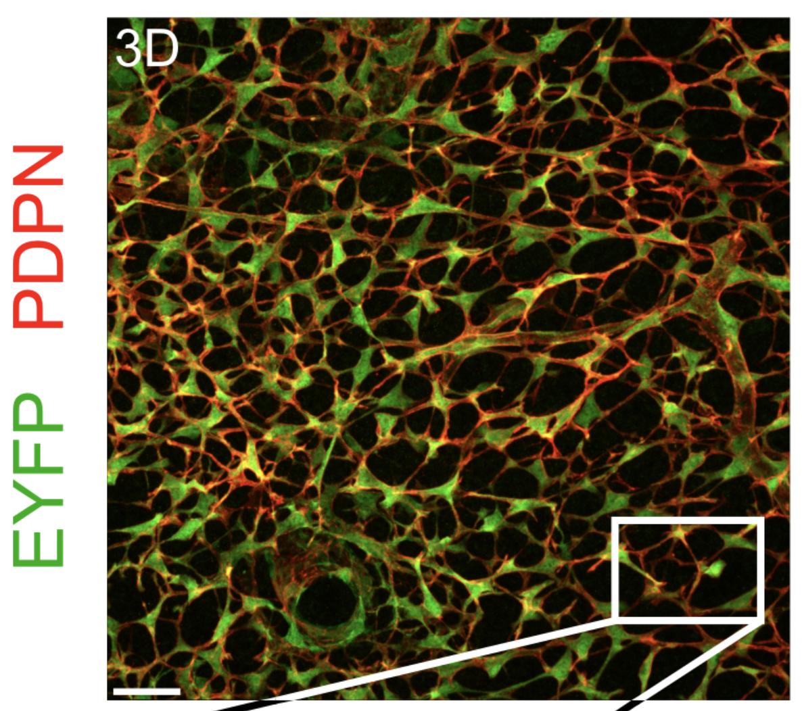
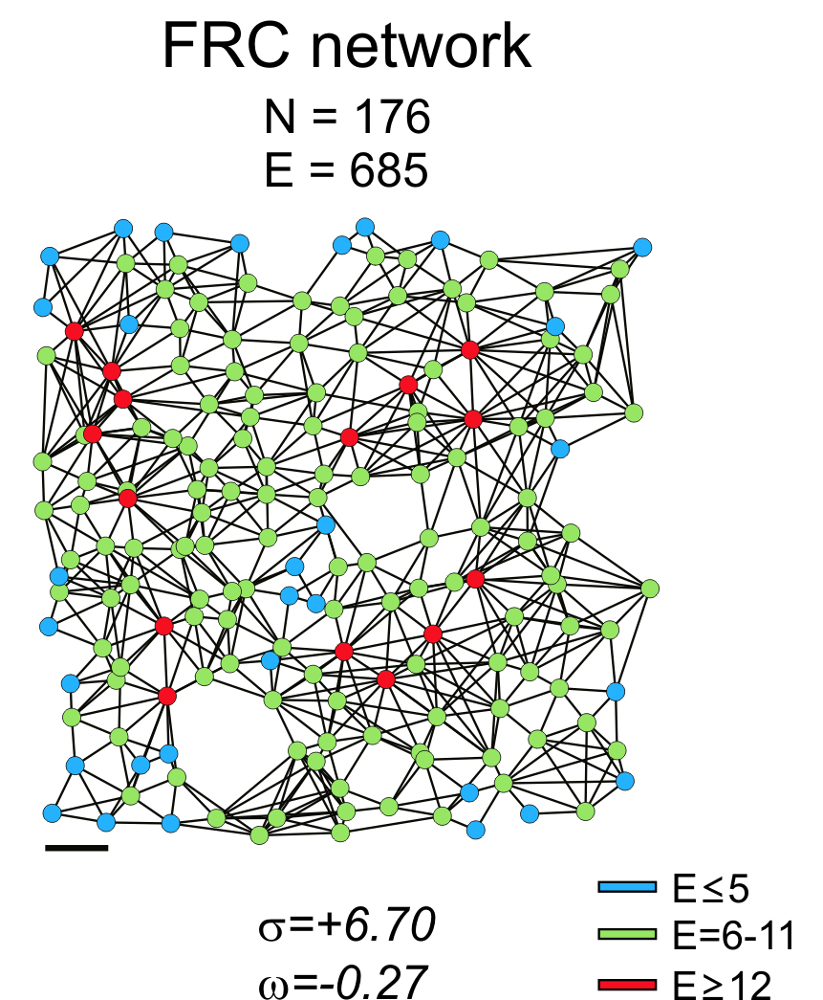
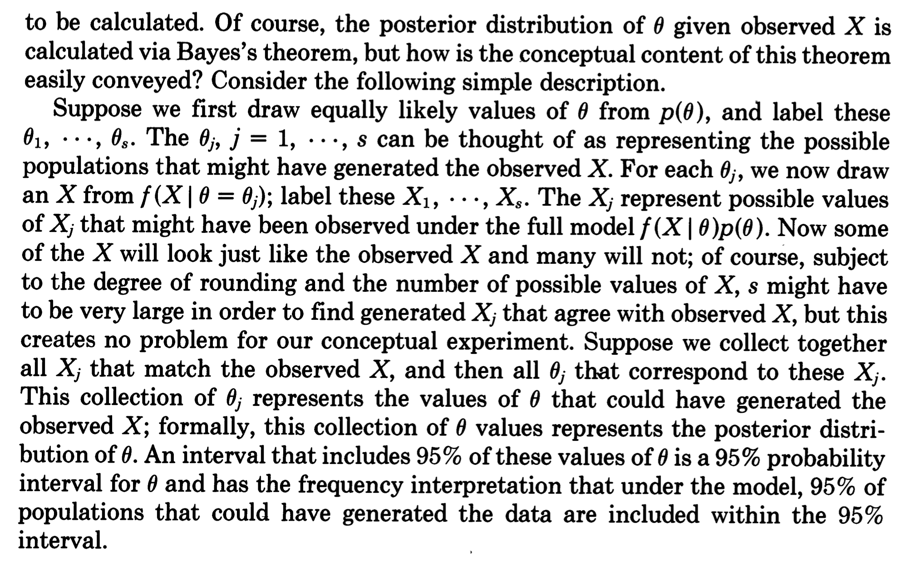

# Likelihood-free Bayesian inference

```{r include=FALSE}
            knitr::knit_hooks$set(par = function(before, options, envir) {
  if (before && !is.null(options$par)) {
    par(options$par)
  }
})
knitr::opts_chunk$set(par = list(bty="l", pch=19))
            
```


## Course logistics

Good morning.
This is our final lecture of this quarter.
Next week we're only going to do exercises or items.
So could I ask you who is intending to show, present anything next week in the final?
Anyone here?
This is not a massive...
Okay, so I put out an announcement,
but next week I would like to actually pre-schedule the things
so that I have a better overview of maybe how many people are doing something
so that we can also do a time that we're not running out of time, let's say.
So I put out an announcement,
and this time I would like you to actually put a short message on the Brightspace forum
when you want to show something in advance.
So that I can make a better planning, okay?
So far that hasn't been necessary,
but I heard now indeed from a few people who are, as they put it,
following the course on distance,
and they would like to show something next week.
So I'll also do one of the sessions next week online for that reason.
So I will have one session on Zoom on Thursday.
There will also be, of course, a normal session on Monday.
And so I'm trying to...
Watch if there's also need for a parallel in-person session on Thursday as well.
So we could basically have one online and one also here.
I don't know if that's necessary
because I don't know how many people are actually going to do something.
So it's a bit hard to judge for me.
But what we will definitely have is one session on Monday,
which will be in person here.
One session on Thursday, which will be on Zoom.
And then, if necessary, another.
And then a session on Thursday in parallel that's also in person with Moabi,
then, most likely.


So the exam is coming up.
That's on the final day of the midterm break.
So I'll make sure that this week
I finish all the remaining transcripts and questions.
And you also get a mock exam to prepare.
About the mock exam, you can use the "Feedback and questions for
teachers" forum on Brightspace to ask any questions on the mock exam.
Okay.
I will not provide solutions for the mock exam questions
because I'm always skeptical about providing solutions
because I think it's often important to realize
that there's more than one solution.
And I would like you to be confident enough in the material
that you can tell yourself if the solution is right.
Okay.
If the solution is correct.
However, yeah, AI has become so good now
that you can just get your solution from AI.
I do that myself because I want to check
is there any error in my question?
You know, is there anything ambiguous?
So I asked ChatGPT to solve all my questions
and it had no problem with that so far.
I have yet to see any mistake by the new ChatGPT model.
So, so far it's going perfectly on all the questions.
So that doesn't mean that it will always give you
a perfect answer.
Because it's a stochastic model.
So, yeah, there might be the occasional mistake.
But I think ChatGPT would be the top student in any class
at this point in any exam, if it's a good exam.
So if there's actually an error by ChatGPT,
more often it is because the question isn't phrased very well
or maybe there's some ambiguity.
And so that's how it is now.
But if you have any questions, specific things
that you don't get about a question, then you're more
than welcome to post that on Brightspace
and I will respond to these things.
But please don't count on me responding on the day
of your exam, like one hour before the exam starts.
So try to maybe at least ask your questions
until the day before the exam
so I also still have a chance to respond.
Any questions on the exam?
Anything that you want to know about that?
I mean, I'm not telling you what is on the exam.
But as I told you, I have a question.
I told you that the questions in the transcripts
are pretty representative.
I will make a selection of similar questions like these.
So if you can solve these, then you should be fine
because the questions on the exam are similar.
Not the same ones, of course, but that's kind of the style.
But you will also see the mock exam
that might be even better as an example of the actual exam.
Okay.

## A quick introduction to Bayesian inference

I was looking forward to this class.
It's one of my favorite subjects.
And, yeah, so it's about likelihood-free Bayesian inference.
I think I asked you this before,
but I probably forgot who has had any exposure to Bayesian methods so far.
And that was in the context of,
and I think you also told me that before, which class, course?
Bayesian statistics and thesis.
For your thesis.
But you also had a course on Bayesian statistics?
And that was what course?
From AI, it's called Bayesian statistics.
From AI, in the bachelor?
Yeah.
Okay.
And others?
Any other?
Yeah.
Are there any other sources rather than the course Bayesian statistics
from AI that you have had anything in?
Are you doing now anything on Bayesian statistics in a different course?
Yeah, even when AI is explained in corporate data.
Okay, yeah.
I mean...
I mean, a Bayes theorem, indeed, even is in our calculus and probability theory class in theory.
It's in there.
So did you already learn about approximate Bayesian computation in the Bayesian...
Do you know that?
So I'm not assuming any background on Bayesian methods.
And in a way, I think the approximate Bayesian computation
is maybe the easiest way to even understand Bayesian statistics itself.
So, yeah.
So that's why we're going to go through that today.

### Quick recap of fitting methods

So first of all, I want to recap basically the methods that we've seen so far.
So, so far, we've discussed actually three different things related to inference, as seen in this table:

|  | Likelihood-based probability model | Loss-based model | 
| --- | --- | --- |
| Fitting | Maximum Likelihood | Loss Optimization |
| Parameter inference | Wald test, Sandwich, Bootstrap | Sandwich, Bootstrap |
| Model selection | AIC, LOO-CV | LOO-CV|


The first was fitting your model.
Yes, we have defined your model, and you want to fit this model to a data set.
And then the second task was to do some inference on the parameter,
meaning that you want to not only know the most likely value,
but also some confidence interval.
So that you can say, I'm relatively certain the parameters may be between this and that value.
And then the last thing that we did last week was model selection,
which is you have multiple models, and now you want to know which is the best one, right?
And for purposes of inference, that means that we want the model to be correct.
But you also learned that correctness can be viewed as being the best generalizing model.
And that is the correct model is the one that generalizes the best.
So if I'm...
If I'm comparing multiple models, and the correct model is among those,
then these methods asymptotically will select the correct model.
But now, of course, in reality, we may never have the correct model.
But we are still using the same methodology to at least try to kick out some very wrong models.
Okay, so we had basically two different classes of models.
One is broadly likelihood-based, and those are typically probability models.
So conditional probability.
And then the other class of models that we had was loss-based, right?
So in some cases, these are the same, right?
For instance, the normally distributed error logistic...
Sorry, linear regression gives you the same solution as the squared loss.
And that was a coincidence.
But in other cases, they might be different, right?
So we learned about other losses, mean absolute error,
and the other class of models that we had was loss-based.
And the Huber loss that lead to different models that are not necessarily probability models.
So generally speaking, there's lots of statistical theory for likelihood-based models.
So we can do maximum likelihood.
A lot of software implements general methodology for maximum likelihood models.
Among those, we have the Wald test for confidence intervals of parameters.
We have the sandwich estimator.
And we have the bootstrap.
And then when we do want to do a model selection,
then we have to look at the Akaike information criterion
and the leave-one-out cross-validation approach,
which actually, in the case of likelihood models
and using the likelihood as your loss function,
are the same asymptotically.
So when we move to loss-based methods,
there's fewer methods that we can apply
because they're not likelihood-based anymore.
But there are still things that we can do.
We can still optimize our loss
in exactly the same way.
It's just a numerical optimization problem.
We can still use the sandwich estimator.
We can bootstrap, which we can almost always do.
And we can also apply leave-one-out cross-validation
for model selection if we have only loss-based models.
So these models give us the most tools,
the most tools that we can use for inference.
And I would argue loss-based models give us,
also, still a very decent set of tools.
The only thing is that we have to use
the slightly annoying sandwich estimator
instead of the Wald test.
But we can still pretty easily do inference
and model selection on loss-based models.

### Loss-less models


Loss-based models are _very_ flexible. Yet they can also present problems:


So now, basically, the question today is,
there might be a case where we don't even have a loss, right?
So basically, we have a model that provides not even this.
So it's, in some sense, even more far away
from the likelihood-based method.
What do we do then?
Not only don't we have a likelihood,
that's still a relatively common case,
but we don't even have a loss.
And that question seems a bit weird,
because now, the first question might be,
what kind of model could that be
that doesn't even have a loss, right?
It seems to be quite easy to define a model
that outputs a prediction,
and then we just compute some loss, right?
It doesn't seem to be very hard.
But there are some valid cases where we have models
that actually don't have a loss,
at least not directly.
So there can be several reasons why we might have
a loss-less model, so to speak.

We may not be able to use a loss if:

 * The loss function is not analytically tractable
 * The loss function doesn't give me meaningful results
 * My model is a probabilistic model


One could be that there are some analytical issues,
so maybe I have a prediction,
but that prediction somehow isn't
an analytically tractable value
for which I can generate a loss function.
Then another thing is that I could have,
maybe I have a loss function,
but it's giving me meaningless results,
and we are looking at an example of that in a second.
So for some cases, having a loss-based model
might be technically passable and implementable,
but for some reasons, sometimes it might not give us
the answers that we would like.
And so maybe the most common situation
is that your model isn't deterministic,
it is actually a stochastic model,
meaning that you don't get one single prediction,
but every time that you put your parameters in,
the prediction also changes,
which means that you can't naively apply a simple loss
because the model itself isn't giving you one prediction.
So that is very common for simulation models, for example.
When we try to build simulation models
that reproduce observed data in some form,
they are often stochastic models,
and in that case, we can't define the loss function.
So one thing that we can do would be
that we run a lot of simulations,
and we run a lot of simulations,
and we basically average the predictions,
and in that sense, at some point, we do get one value,
but that is quite computationally expensive,
and it can mean, if our model has, for example,
10 different parameters, it could take literally weeks
for us to estimate even just one prediction.
And then to plug that into a numerical optimizer
is going to be difficult.
So most numerical optimizers are designed
for deterministic functions,
and they will struggle if there's even a bit of noise,
in that function.
There are now, of course, also stochastic optimizers,
which are very frequently used in machine learning,
because in machine learning, we have the same thing.
The loss function could maybe be computed,
but it could also be that I have to then evaluate
my entire data set, which could maybe take a lot.
So what we're typically doing in machine learning
is that we sample a mini-batch,
and then we estimate our loss on the mini-batch,
and that's also a noisy version of the true loss, right?
So also there, we have to issue that we can't, you know,
we can't use a deterministic optimizer,
because it's never going to converge.
So I've actually investigated if we could do the same thing
for statistical inference,
but the problem is that a lot of the theory that we have here,
like developed, the sandwich and the boots,
and the sandwich, for example,
that assumes that we have a second derivative,
and if our function is noisy, then we don't have that, right?
So the most common situation where you cannot use
this framework anymore is that for whatever reason
that you cannot, that you don't actually have your loss,
for instance, because it's either too,
it's either a probabilistic model in the first place,
or it's too expensive to compute,
and then you have to kind of estimate it by sampling
somehow as in machine learning.
So the question is, then what do we do?
And so one solution is then to move to Bayesian methods,
because Bayesian methods are actually quite nice.
They're quite nicely suitable for these kind of models
that are non-deterministic.
Bayesian models themselves are inherently probabilistic models,
so all of this framework of Bayesian inference
is actually a quite nice fit for this case.

### Example: Bayesian inference of a fraction

For a quick comparison between Bayesian vs. Frequentist Statistics by Stats with Brian:
https://www.youtube.com/watch?v=qJcv7VHwqcA

So let's look at one example.
So I had just mentioned that in the chat GPT,
the newest version seems to do perfectly on all my questions.
So let's say I give it 10 questions,
and it gets zero of these questions wrong, right?
The question now is, okay, so the most likely,
let's say I consider the probability that chat GPT
gets something wrong as an inference target,
and I want to estimate the probability.
What's the most likely estimate of the probability
given this data?
I would do maximum likelihood of loss-based model,
and I would optimize it on this data set,
and what would be the most likely value
of the underlying probability that it gets something wrong?
Yeah, it is zero, so my most likelihood method
would tell me, okay, so given this data,
the most likely P, so the probability
of getting something wrong, is zero.
Okay, great, but now we also want to quantify
the uncertainty somehow, right?
So let's say we're gonna use
bootstrapping, so we have our data set
that contains 10 zeros, and now we bootstrap
from the data set and create sub-samples of the data set,
and what is our bootstrapping sample going to look like?

> Only zeros.

Yeah, because if you re-sample from zeros,
the only thing that we can get, zeros, right?
So in that case, we would get a 95%,
even a 100% confidence interval telling us
chat GPT is perfect, so we are, it's not only the most likely,
answer, but we're actually given on our bootstrap analysis
100% certain that it's the correct answer.
So something's wrong here, right?
So this is a case where the framework that we've presented
doesn't really provide a meaningful answer,
because clearly we cannot be 100% certain
based on only 10 observations.
But that's what the bootstrapping approach
would give us here.
The Wald test actually would be better here,
in this case, the Wald test would say something like,
okay, zero, but still a standard error is, I think,
one-tenth, which makes sense.
But I just, I mean, it's just an example
that these methods can sometimes break down,
and it often happens if our most likely estimate is so bad,
and on the border of some parameter space, for example.
And the other thing is that,
let's say we want to take this P as an estimate
and plug it into some other model, yeah?
Then other models might start to say,
oh, this might struggle if you're providing a P of zero
as a plug-in estimation,
because then maybe they want to compute
the log likelihood of that,
and they take the log of zero,
which is going to be minus infinity.
So this is also a slightly awkward estimation to get.
And also, kind of philosophically,
it seems weird that we would say
the most likely case is that ChatGPT is perfect, right?
It doesn't seem to make sense,
because very likely it's not perfect,
it's a large language model.
We just haven't, of course, observed enough data,
but so based on that to say we are most,
the most likely case is that ZGBT is perfect seems weird,
right, it seems like a weird conclusion.
So why do we get this conclusion, by the way,
and why do we think it's weird?
It is because the maximum likelihood estimator
is actually biased, right?
On small samples, it will give you results,
it sets it on average off,
it's not an unbiased estimator in many cases,
and here we are basically interpreting
a biased maximum likelihood estimator.
A sample is quite small,
and so the true value is probably something like,
I don't know, one in a thousand questions or something,
but we just haven't seen enough data to observe that.
So, yeah, so that's one example where
we're using a methodology that we've talked about so far,
doesn't really give us a meaning for that.

### Bayesian inference in a simulation setting

So, another example is indeed simulation models.
So, simulation models are a whole new class of models
that we haven't talked about before.
So basically any computer program that outputs a value
can be seen as a simulation.
Simulation models are often easier to build
than mathematical models,
because you just write down in code
how you think the process is working.
that you are trying to model.
And so that also makes them very flexible, right?
So there's different kinds of simulations,
discrete simulations, agent-based models,
literally games, right?
So people building entire worlds in a computer.
All these things are basically covered in this framework.
So anything, it can be very complicated models too, right?
So it could be that running one simulation once,
I had a colleague in Utrecht
who was doing some evolutionary biology
and he was running these simulations that took a year.
After one year, you would get one result.
So but that's covered by this framework.
So the important case here is
that a simulation is often stochastic.
So it's often that we say, okay, randomly people,
for instance, simulations have been also used
in the COVID pandemic to predict the spread of the virus.
And then you would say, well, randomly people move around
and randomly they meet each other.
And whenever they meet each other,
there's a random.
There's a random chance that the virus gets transmitted
or something like that, right?
So that means if you run the same simulation model twice,
it will just give you a slightly different number
every single time.
It's just in the model.
Not all simulations are stochastic, okay?
But many of them are.

### Applied example: Modeling cell networks 

So let's look at a concrete example.
I chose this one.
So that was about network science.
I've actually seen somebody choose a network data set.
So I thought it might be,
that would be a nice example to discuss.
So here we have a network (the image is taken from this article:
<https://journals.plos.org/plosbiology/article?id=10.1371/journal.pbio.1002515>)




And this network consists of cells in the lymph node,
these green cells here.
And they have these red, these red basically arms
and they connect to each other.
And so this is a network of cells.
It's a bit like, it's very different from the neural network
in the brain, but people also use the same methodology
to analyze neural networks in the brain just by imaging the cells
and trying to find the connections.
So we would like, maybe would like to understand how,
how this network was created, right?
So, and, and we can't really observe that.
This is in a mouse, but even in a mouse,
we can't really watch the whole network grow.
We just give, get this network.
And now the question is what process might have constructed
this network and what might the properties of the process be?
So one approach is then to basically convert this image,
so that's from this paper here, that image into an abstract graph, right?
So we have to.
So people did image analysis and they identified the locations
of each of the cells and then they identified the connections
between the cells and now we just have a graph:



So now our question becomes: how was this graph created?
What's the process that made this graph?
And that's what we call network science.
So there's an entire field that studies how networks are made
and what different processes can give rise to certain properties
that we observe in these networks.

### Small world networks

So in this paper, they studied this graph and they said,
this is a small world network (the term was coined in this paper:
<https://www.nature.com/articles/30918>).
A small world network is a network where every node has
many local connections, but also some remote connections.
And it means that a small world network is at the same 
time very clustered,
meaning that, you know, the friends of your friends also tend
to be friends with each other.
It's an example of clustering.
But also the shortest path between any two given nodes
in this network is quite short ---
shorter than we would expect if, for example,
this was a lattice where we only are connected to our neighbors.
That means that the shortest path to somebody
who lives very far away could be quite long.
And so there are many examples of small world networks.
There's this famous thing with the seven degrees of separation,
which means that we basically know every other person
in the world through a chain of only maybe five people,
which is surprisingly few people.

People who study networks reported that many networks
that you observe in nature have this small world property,
that they're both clustered, but also the shortest path
between any two nodes is relatively short.
So in this paper, they were saying this network here looks
like a small world network.
Okay, so they were saying, okay, so this is the network.
And then they computed these numbers, sigma and omega.
These are numbers in network science.
I really won't explain what they are, but the thing is,
if your sigma is high, then that is a measure of small worldness.
So the sigma that would be negative would be less clustered.
So basically, it's something like you're comparing the path length
to the expected path length in a random network,
and you're comparing a cluster.
You're comparing the clustering to the expected clustering
in a random network.
If this gives you a large number, it means that there's lots
of clustering, and the paths are short.
And that way, you get a large number, right?
So a large number means that the network looks
like a small world network.
And that was the evidence that they showed here.
So, but now, our question might be,
how has this network been created?
And what can we infer about this process?
So we can think about this.
We can think about different simulation models.

### The Watts-Strogatz model

So one example would be the _Watts-Strogatz_ model.
That's a classic in network science.


The _Watts-Strogatz-Model_ (in 1D) assumes that:

 * We start with a ring of $N$ nodes, where each is connected to its neighbours
 * With probability $p$, we "re-wire" each edge to connect two random nodes

So in the Watts-Strogatz model, it's
a model where you start with the lattice.
So lattice is a regular network where, for example,
a 1D lattice is simply a ring.
So you put your nodes on a ring, and you connect your nodes
to the nearest k other nodes in the ring, right?
And then you take, you start rewiring connections.
So you look at each edge in the network,
and with a certain probability, you remove that edge,
and then you connect the same node
to a completely random other node.
So that's called the rewiring step, okay?
So initially, you are only connected to your neighbors,
but then you get randomly connected
to random other people in the network.
And so this process generates,
networks that have this small world property.
And of course, depending on how large this probability p is,
right, if p is very small, there will not
be many additional connections in the network.
And if p is one, it will be a random network in the end,
because none of the network connections
that were there initially will survive.

So if we look here, for example, this is an igraph package.
It's a big package for graphs and network analysis.
This would be, this is even in the package as a function,
`sample_smallworld`, that generates random small world networks.

```{r wattsstrogatz}
library(igraph)

g <- sample_smallworld(dim = 1, size = 176, nei = 4, p = 0.1)

plot(g, layout = layout_in_circle,  vertex.label = NA,  vertex.size = 5)
```

We can check here what happens when we change that probability.
For this example, the probability of rewiring
is set to $p=0.1$, and it gives you quite many rewiring connections.
If I set the probability to $p=1$, or a large value like $p=0.9$,
I would expect basically the circle structure
is completely gone:

```{r wattsstrogatz2}
g <- sample_smallworld(dim = 1, size = 176, nei = 4, p = 0.9)
plot(g, layout = layout_in_circle,  vertex.label = NA,  vertex.size = 5)
```


And if I set $p$
to a smaller value, like 0.01, for instance,
then you have only a few extra connections:

```{r wattsstrogatz3}
g <- sample_smallworld(dim = 1, size = 176, nei = 4, p = 0.01)
plot(g, layout = layout_in_circle,  vertex.label = NA,  vertex.size = 5)
```

The parameter $p$ basically controls
the local versus global connectivity in this network.

Now we have the simulation model,
and maybe we want to now fit this model to our data set.
We have this observed network, and we might want to know,
what is the most likely value of p given the data that we observe, right?

Assume that this network really was created by the process described in the Watts-Strogatz model.
Then this is an inference problem like any other inference problem.
We have a parameter, and we want to know the most likely value,
and maybe also we want to have some confidence in that.
This would be a typical realistic setting
of where we have a model that we cannot really compute a loss function for.

We could, for example, measure the values $\omega$ and $\sigma$ that they used to describe their network (see picture above), 
and compare it to value of $\sigma$ we obtained from our simulation.
But it's going to be a different value every time that we run this simulation.

### The preferential attachment model

We could also consider alternative explanations for 
how the network was generated.
Maybe instead, it was actually started on a 2D lattice.
And actually, we could maybe say, well, in a real physical network,
like this cell network, maybe it is still more likely
that you're connected to nodes that are close by than to nodes
that are far away.
So we might make a modified version of that model where we say, well,
we assume that it is more likely to be connected to a node that is close by
than far away:

 
 * We start by putting our nodes on a 2D lattice
 * We then pick a node $u$
 * We connect $u$ to another node $v$ at random with weight $\exp( -\beta \, \, \Vert u-v \Vert )$, where $\beta$ is a parameter 

It's also a single parameter model ($beta$ is the only parameter). 
And then we could ask, which of these two models is better?
Or which one explains the data better?

Here's an R implementation of the preferential attachment model. It generates a network by looking at every node, and then sorting the other nodes by the distance to that node, and then sampling
connections with a sampling weight of $\exp( -\beta \, \, \Vert u-v \Vert )$.

```{r geoattach}
library(igraph)

spatial_network <- function(n, beta, nei) {
  # Create n x n lattice coordinates
  grid_size <- ceiling(sqrt(n))
  coords <- expand.grid(x = 1:grid_size, y = 1:grid_size)[1:n, ]
  dist_matrix <- as.matrix(dist(coords))
  g <- make_empty_graph(n, directed = FALSE)
  
  # Keep trying random pairs until we have enough edges
  while (ecount(g) < nei*n) {
    i <- sample(n, 1)
    
    # Find nodes not yet connected to i
    neighbors <- neighbors(g, i)
    connected <- 1:n %in% c(i,neighbors(g, i) )
    if( all(connected) ) next
    
    candidates <- which(!connected)
    d <- dist_matrix[i, candidates]
    j <- sample(candidates, 1, prob = exp(-d/beta))
    g <- add_edges(g, c(i, j))
  }
  V(g)$x <- coords$x; V(g)$y <- coords$y
  return(g)
}

g <- spatial_network(n = 176, beta = 0.2, nei = 3)

plot(g, layout = as.matrix(cbind(V(g)$x, V(g)$y)),
     vertex.label = NA, vertex.size = 5)
```


The parameter $\beta$ basically tells me how strongly close connections are
favored with respect to far away connections.

So there's a different model, and I could certainly come up with, and this would give
me a network that looks a bit like this.

At first sight, the preferential attachment model looks like it's more realistic.
First of all, it's 2D, and second of all, it doesn't allow connections like this to
be very easily formed, and it might actually be difficult in a real physical situation.
And now maybe you can come with yet another hypothesis about how this network could have
been generated.
And then we would want to do model selection in order to see which of these hypotheses
is most consistent with the data here.
Okay, so that's like inference, model selection, similar questions as before, but now just
the models are different.


Now we have simulations that create something.
And so they are often used with complex data structures like this, right?
There are no linear regression models for networks, as far as I'm aware, at least.
If you have DNA sequences, text, structured data, XML, whatever, it's often easier to
make generative models or simulation models in order to model your data than to make some
statistical model, right?
But the question is...
The questions that we have are the same ones, right?
We still have parameters, and we still want to know their values, and we still want to
be quantifying the uncertainty.
Okay, so that sets the stage for what we're trying to do, and now the question is how
do we do this, right?
So we have no loss function, and we don't have a likelihood function, certainly, but
we still want to fit this model somehow to data.

### The Bayesian version of "fitting"


Okay, so now let's look at how the Bayesian frameworks helps us to do this.
And first of all, we need to talk about the concept of fitting and what that means in
the Bayesian framework.
So what is Bayesian statistics about?
Bayesian statistics is basically about trying to compute this thing here, which is the so-called
posterior distribution:


$$
P( \theta \mid X )
$$ 


In other words, in the Bayesian world, inference is the following problem:


*  Given: data $X$, model $M_\theta$ 
* Wanted: parameters $\theta$ such that $M_\theta$ "fits" $X$.


In our previous approaches, we have a probability of the parameters conditioned on the data.
In our previous approaches, we typically do the opposite.
We have our parameters that we plug into the model, and then we want to know what is the
probability of the data given those parameters, right?
So Bayesian statistics is switching that.
It also means, if you remember vaguely the first week, we talked about that there's two
different interpretations of probability.
We have the so-called aleatorial interpretation and the epistemic interpretation, right?
So aleatorial was that we were talking about chances, repeating experiments and so on.
That's what we believe probabilities are.
But here, it's the so-called epistemic interpretation, which means this is not about the chance that the parameter has this value.
It either has the value or it doesn't, right?
It's about our certainty or belief that the parameter has this value.
So here we are saying probability, but what we really mean is belief.
And we believe that, so first of all, when we start the experiment, we have maybe some prior belief.
And then by observing data, this belief hopefully changes.
If you're a scientist, then we should change our opinions based on the data that we observe.
And that's basically what is modeled by Bayesian statistics.

Bayesian statistics therefore corresponds to a very different philosophy, even a different interpretation of what probability actually is. Many people find this attractive, as it seems to fit how we "intuitively" think about science.
And when often people who don't know much about statistics and probability are confronted with the results of experiments,
then they tend to interpret them in this way.

So you tend very much to read a p-value, for example, as the probability that the null hypothesis is true, which it isn't.
But this would be a Bayesian interpretation.
And it looks like Bayesian statistics fit 
that kind of intuition better.

A problem with Bayesian statistics is that it's normally very difficult to compute the posterior distribution analytically.
In most cases, we have no way to compute these posteriors except for very simple cases.
So we typically need to use simulation in order to do Bayesian statistics.
Methods like Markov chain Monte Carlo (MCMC), for example.
This means that fitting a Bayesian model could easily take half an hour even if its likelihood version could be computed in milliseconds.
In that sense it's a bit more technically demanding than frequentist approaches.

Did any of you in your courses fit models or estimate posteriors?
Did you use something like Stan or what did you use?

> Jax

Jax is an example of a probabilistic programming languages where you can write down your model
and then all of the sampling and so on happens under the hood, typically.
But you will have experience that this can take some time in some cases, right?

> Yeah.

So that's the big issue.
Okay, so what this thing doesn't have, like so in a likelihood approach,
you're typically using the parameters that explain the data best.
So that's the fitting, right?
So we have given the data set and now we're trying to fit our parameters to the data set.
It's often the first step in likelihood-based inference and also in loss-based inference.
So here in the Bayesian concept,
that seems okay.
It seems weird that we would fit, we don't fit the parameters to the data.
We want our data to inform the parameters.
So there is no such thing as fitting, really, in Bayesian statistics.
That's the first thing that is very different.
What we do have is the posterior distribution itself,
which can give us, if we want to, we can take something from the posterior distribution
and use that.
That's our fit, right?

### Recap of the Bayes formula

But first, let's recap the Bayes formula:

$$
\underbrace{P( \theta \mid X )}_{\text{posterior}} = \frac{\overbrace{P(X \mid \theta)}^{\text{likelihood}} \, \overbrace{P(\theta)}^{\text{prior}}}{\underbrace{P(X)}_{\text{marginal probability}}} 
$$

The _prior_ is given.

Most often we don't know the _marginal_, which isn't a problem in practice.

The _likelihood_ is dependent on our model. Some models have very complex (or unknown) likelihood functions.

We've seen this before (in the first lecture).
This is the Bayesian formula and this is how Bayesian inference is typically done.
So we want to get this thing here on the left.
And so what we do is we start with our _prior distribution_.
We then combine this with our _likelihood function_ from the model.
And then we have this thing called the _marginal probability_,
which is the probability of the data that often we don't have.
And that's often one of the reasons that we need to do simulations.
That's because we can't really compute this thing.

So likelihood is in here, right?
So if you have a model that has a likelihood function,
then you can do Bayesian statistics as well if you want to.
You also need to add a prior, right?
But let's say any of the likelihood-based models that we have discussed so far,
linear regression, logistic regression, they have a Bayesian.
There are Bayesian versions of them.

So you can just use the same model, add a prior to the model, and then,
and then plug it into your favorite Jax or Stan
or whatever framework and then you can do Bayesian statistics.
So it doesn't seem that this is gonna help us much, right?
Because it looks like the Bayesian framework
is actually more restrictive than loss-based framework here
because we need a likelihood function
for the Bayesian framework.

## Approximate Bayesian Computation (ABC)

For understanding why Bayesian inference helps with 
simulation models,
we look at this 1984 quote by Donald Rubin (from this
article: <http://www.jstor.org/stable/2240995>)
Donald Rubin has made many contributions,
ranging from missing data analysis to EM algorithm.
And he also kind of introduced in passing
the idea of approximate Bayesian computation.
The quote reads:



In this article, Rubin proposes explanations for
why don't people use Bayesian statistics so much --- 
maybe it's too complicated.
So we need to come up with a simpler way
to explain what Bayesian statistics is.

Rubin proposes an explanation
in terms of a sampling procedure.
What he says here is this:

1. Sample $\theta_1, \ldots, \theta_n$ from the prior $P( \theta )$.
2. Sample corresponding $x_1, \ldots, x_n$ from $P( X \mid \theta )$.
3. Remove all $\theta_i$ where $x_i \neq x$. 

To repeat: First we draw values from the prior.
Then, we generate data from our model
given these parameters and then we remove --- 
we reject, we throw away --- the samples
that look different from our real data.

That's basically what the Bayesian formula does, right?
So you sample,
you put the samples into your model
and you throw away the data
that doesn't look like your data
and that's the Bayesian formula.

So it takes a while to digest that
so we should look at this in more detail
and simpler words maybe.
So the Bayesian formula has three different terms:
 the prior, the likelihood, and marginal probability.
 Each of the terms can be mapped to one step in Rubin's
 procedure like this:

$$
\underbrace{P( \theta \mid X )}_{\text{posterior}} = \frac{\overbrace{P(X \mid \theta)}^{2.} \, \overbrace{P(\theta)}^{1.}}{\underbrace{P(X)}_{3.}} 
$$


So the first step is we sample from the prior.
That corresponds to term 1, giving 
the probability
that the $\theta$ comes out of the prior.

The second thing we do
is that we plug our parameters into the model
and we generate data from the model.
That's what we do in term 2.

And then the third step
is that we throw away
the data that doesn't look like the X
that we're interested in
and that's basically the dividing by this P of X.
What that basically does
is restricting your sample size space
to only the Xs that you want. This corresponds to term 3 in the formula.

So this is literally what the formula means,
but now interpreted in terms of simulation.
And the only thing you need to be able to do to follow
these steps is that you can sample from the prior and from 
your model.
That's all! There's no likelihood mentioned in Rubin's algorithm.
The only thing that we need to be able to do
is generate data
and then we can evaluate the Bayes formula.

So, this algorithm is actually literally also a recipe
for computing a posterior.
It's not a very efficient recipe --- that's why it's typically not 
used in something like Stan or JAX --- 
but it is a possible recipe.

The reason that we don't use this recipe in Stan, JAX or similar
is  
we often actually do have a likelihood function
and then we can use,
for instance, MCMC, which is way more efficient than this.
The reason that the above method is very inefficient
is that most of the samples I'm generating
might look very different from my data,
so I have to throw most of them away.
And in reality it might mean
throwing something like 99% of my data away,
or more ...
So it can be computationally quite demanding.


But if you don't have a likelihood function,
we can still use Rubin's procedure --- and 
so this is something that we can do
with _any_ simulation model!
We can go through these steps
and generate samples from the posterior distribution.

### Example: Estimating a proportion

Okay, so let's show how this works using our earlier example.
We said, yeah, we want to have
a kind of more meaningful estimate of the proportion,
than zero, right?

So let's say we make a new political party,
--- why not? ---
called the data science party (DSP)
and we're going to participate in the upcoming election.
As a part of that, we're going to ask people
if they would want to vote for the DSP.
We ask 10 people, and they all say no, we won't.

Now the question is,
what can we infer from that information
about the "true" fraction of DSP voters in the population?

We have seen before how that would work --- or rather, wouldn't work --
in a bootstrapping approach. So let's now try the Bayesian approach.

In the Bayesian approach, we first have to decide for a prior
--- specify our initial hypothesis
about the distribution of this proportion.

What we  typically do if we don't know anything is that we
impose a so-called _uniform prior_. In this case, that would mean
specifying that the underlying fraction $\theta$ 
is uniformly distributed between 0 and 1.
Anywhere between zero and 100% of the people
are going to vote for us, and that's all we know.

We could also make a better prior,
because it's actually very unlikely
that 100% of the people are going to vote for us.
So in this case, it might also be justified to
use a prior that puts more weight
on small numbers.
But let's just pretend we know nothing at all,
and use the uniform prior.

Let's see how we can now implement Rubin's algorithm.
We start by generating samples of the parameter 
$\theta$,
from our prior, which here just means now sampling
from a uniform distribution.
Let's generate 500 values for theta:


```{r abc1}
theta <- runif( 500 )
```

And now we are using these to sample
from a binomial distribution.
The binomial distribution throws a coin 10 times in this case,
and then counts how many times it lands one side.
This would be the success probability.
OK?
So we're throwing 500 coins, and each of these coins
has a success probability coming from the prior
that we just generated.
So this is our simulation here:

```{r}
X <- rbinom( 500, 10, theta )
```

This simulation flips $500 \times 10 = 5,000$ 
coins in total, in batches of 10 coins.
And each of the 10 coins in a batch are thrown according
to the corresponding value in `theta` that we have generated before.

And now we just make a plot, how that looks like:

```{r}
par( mfcol=c(1,2) )
plot( theta, X, pch=19, 
	col=c(rgb(0,0,0,.25),
	rgb(1,0,0,.25))[1+(X==0)] )
beeswarm::beeswarm( theta[X==0] )
beeswarm::bxplot( theta[X==0], add=TRUE, col=2 )
```

This would be the entire data set that we generated.
So we have uniformly distributed fractions on the bottom here.
And here for each fraction, we can
see how many of the 10 coins landed one side, right?

So if our fraction of people that would vote for us is low,
then chances are that most likely 0 or 1 person in our sample
would say that they'll vote for us.

But if the chance of people voting for us is super high,
then we might get more likely something like 10 or 9 people
saying they'll vote for us.

So this is how the first two steps of Rubin's algorithm work.
The final step is to "throw away" all the data that
doesn't look like what we observed.
What we observed was that nobody wanted to vote for us,
so we need to keep the `theta` where `X==0`, highlighted in red
in the plot above.

This subset of `theta` values --- the "slice" of the sample
where `X==0` --- is our posterior distribution.


That's the Bayesian method in a nutshell.
It's really quite intuitive to think about it in this way.
You simulate from your prior, which you
can define in whatever way you want.
Then you plug your prior into your model.
You simulate from your model, generating the vector `X` in our case.
And then you throw away all the samples from the prior 
that did not generate data that looked like the data you observed.
And what remains is the posterior distribution.

In contrast to frequentist inference, where we _fit_ parameters to datasets, here we always get entire _distributions_ of parameters.
But if you wanted to compress this distribution to one value, you could use for example the mean, the median, or the mode of this posterior distribution. Here, that would give us something like approximately 5%
of the people might be voting for us.
But it could also be 10% and also 0%.

Coincidentally, 5% is half of 1 tenth, right?
And that's not a coincidence, actually, because you can in this case also do the Bayesian calculation analytically.
And then the  _mean_ of the posterior that you will get would be 

$$
\frac{k+1}{n+2}
$$

where $k$ is the number of people out of $n$ we asked who said they'd vote for us, while the posterior _mode_ we would get would be

$$
\frac{k}{n}
$$

That means if we'd ask 10 people and found no one, the posterior mean 
would tell us that maybe we can still hope that 5% would actually vote for us -- we can't confidently rule out values lower than 10% based on our observation.

> What's your criteria for how you throw away the data that doesn't fit?

Here we have discrete data, so we just use equality. 
We observed $k=0$, so we're just throwing away everything other than $k=0$.

But, it's not always that easy --- actually, that's maybe the hardest thing about approximate Bayesian computation.

For continuous variables --- like, say, these $\omega$ and $\sigma$ value from our FRC network example -- the observation $X$ could 
be any real number.
And if I've observed $\sigma=6.53$, then a chance
to get exactly 6.53 out of my simulation
is going to be super tiny.

So in reality, we need to actually do something like this: we _approximate_
$$ P( \theta | X = x ) \approx  P( \theta | d(X,x) < \epsilon ) $$
for some distance $d$ and small threshold $\epsilon$.

This approximation is what leads us to call Rubin's algorithm _Approximate Bayesian Computation_ (ABC).

We need to define some distance function $d$ between the data
and the simulation result.
And then we need to set some threshold $\epsilon$ that specifies
the most we want to deviate from the data.

Under certain restrictions for $d$ -- it has to be a _sufficient statistic_ -- as $\epsilon \to 0$ and the number of samples goes to infinity, the ABC algorithm outputs the true Bayesian posterior. 

In practice, the choice of $\epsilon$ is also determined,
by our computational resources. For instance,
if we need to do 10 million simulations to get even just one
dataset that "passes" with a small $\epsilon$ ,
then we might have to increase the $\epsilon$ 
for computational reasons. Despite this, ABC is still a state-of-the-art method for so-called "simulation-based inference". There are now other methods where we're
trying to use deep learning to do this a bit more efficiently, for example by "interpolating" in some sense between the generated samples.


To summarize, ABC is both a way to think about how Bayesian inference itself works --- this is how it was first introduced --- and a practical method for simulation-based inference. The only requirements for using ABC are that (1) I can specify a prior distribution for my parameters (which could be a uniform prior over some reasonable range), (2) I can simulate data from the model I'm fitting. You could also use ABC for loss-based or likelihood-based statistical models, but that would be very inefficient, and you'd be better off using "proper" Bayesian inference, perhaps based on a "probabilistic programming language" like Stan or JAX.

_(Break)_

## Student contribution

A student showed the website <https://statdist.ksmzn.com>, where you can view all kinds of probability distributions. Thank you! As an example, I showed the Beta distribution. The Beta distribution generalizes the uniform distribution (which corresponds to the special case where both parameters are 1). If we change the shape, we could for example put more weight on smaller values. For any Bayesian estimation of a fraction (as in our example above), the posterior distribution can be analytically determined (it is also a Beta distribution).

## ABC (continued)

Since
two of you asked me the same question during the break,
I thought I might clarify something once again.
When we looked at the plot above, the number on the Y axis
was the number of people out of 10 that said they would vote for the
DSP (or, to use our earlier example, the number of mistakes ChatGPT made when asked 10 questions). We can get therefore get the posterior distribution by selecting the $\theta$ values for which $X=0$. If, instead, we had found 4 out of 10 people who want to vote for us (or, if ChatGPT got 4 out of 10 questions wrong), then we'd have selected the $\theta$ values for which $X=4$

So, the ABC algorithm in some sense doesn't only generate the posterior _we_ need --- it actually generates all possible posteriors. I could have used the data shown in the plot above to generate posteriors for _all_ possible values of $X$. That's
 why it's a shame that we in fact throw all these
other data away --- but they're, unfortunately, not consistent with what we observed. But
if we wanted to perform,
"thought experiments", like "what would we
have said if ChatGPT had made one mistake?"
then we can also get that from the same result.

### Example: Customer churn data

Now let's look at a slightly more
realistic example.
We talked before
about the survival models,
and then we used this kind of data,
and I made it smaller,
so to make the example smaller, but
this was this customer churn
example, where we
observed customers of some streaming
service for 200 days, and then we
watch as they cancel
our subscription:

| days | fee  (€)       | age | free_trial |
|------|-------------|-----|------------|
| 12   | 16          | 25  | 0          |
| 34   | 9          | 19  | 0          |
| 45   | 16          | 28  | 0          |
| 71   | 9           | 35  | 0          |
| 95   | 9           | 38  | 1          |
| 142  | 9           | 41  | 1          |
| 156  | 9           | 52  | 1          |
| 200+  | 9           | 45  | 1         |

And the question was,
do people who did a free trial
in the beginning actually maybe stay
longer?
And are more
loyal to our streaming service?
So last time
when we looked at this data, we fitted
the Cox proportional hazards
model to this data, which is
a model that has only a so-called partial likelihood
because it doesn't model the actual data,
it only models the
order of the data. We only
look the
_ranks_ of the dropout times by sorting the customers
by the time they quit, 
but we didn't really use the dropout times.

If we wanted to do a better job, and we want to
model the actual data, we might again consider
a simulation model.

So here we're now going to do the following:

We do the following:

 * Randomly generate 8 customer churn times, by sampling from some prior, and sort them
 * Here, we flip a coin every day with success probability $p$. In case of "success", customer cancels.
 * Compare the $i$th simulated time to the $i$th real time
 * Keep the sample if the overall absolute differences between (a) sample mean and simulated mean and (2) sample standard deviation and simulated standard deviation are both small.

If the probability $p$ is high,
for instance, 0.5,
you would cancel in two days on average.
If $p=0.01$, you would cancel in 100 days on average.
So by tweaking this p,
we can make our model fit the data that we have.

This simple model could be fitted using maximum likelihood as well in this simple case (perhaps try this as an exercise)! But I  want to show how this works
in a Bayesian framework using ABC.

Let's write the code. We start with the times at which the customer's canceled:

```{r abcchurn}
X <- c(12,34,45,71,95,145,156,200)
```

The last time is a bit special because it is
just end time of our experiment.
We cannot actually distinguish this customer from 
anyone else who stayed for more than 200 days.

```{r}
churn <- c(1,1,1,1,1,1,1,0)
```

Now let's define our 
distance function. Here as well, we need to take care of
the fact that we can't distinguish anything beyond 200 days.
So we'll just truncate every simulated churn time larger than
200 to 200 days. To compare the simulated and real data vectors,
we summarize them using their means and standard deviations.
This is called _moments matching_ -- mean and variance are the 
first two moments, and we could also have looked at the third
moment (skewness) and the fourth moment (kurtosis), for example,
but our dataset is a bit small for that.

```{r}
dist <- function( x ){
	x[x>max(X)] <- max(X)
	abs(c( mean(x)-mean(X), sd(x)-sd(X) ))
}
```

I'm using the absolute difference
between the simulated and the real moments here.
I could do this in all sorts of different ways:
use the squared distance, or Huber loss; 
or ignore the standard deviation.
These are the choices I need to make when implementing ABC.

Here we have a 2D distance function,
where the first dimension
is the absolute difference in mean,
and the second is the absolute difference
in standard deviation.
And we want both of them to be small
so that we accept the sample.
Here, let's use a single $\epsilon$ value of 10.
I could also use different epsilons here
for the different dimensions if I wanted to.


```{r}
epsilon <- 10
```


So 10 means that our simulated data's mean
has to be at most 10 away from the actual mean,
and the simulated data's standard deviation
has to be at most 10 away from the actual standard deviation.
If that happens, then we are going to accept the sample,
and if it doesn't happen,
then we are going to reject the sample.


Now we have to define our prior.
Here we'll just  use a uniform prior
between 1 and 300 days
it will take to cancel on average -- I'm using
300 because the largest value
in the data is 200, and I want to go a bit beyond that:

```{r}
prior <- function() runif(1, 1, 300 )
```

And the model is simply, so this coin-flipping thing
is what we call a geometric distribution.
So I'm not gonna flip the coins, actually.
I'm just gonna use a sample from a geometric distribution,
and this means flip eight coins
and tell me how many of them are successful.
So this is my simulation model:

```{r}
model <- function(m){ rgeom( 8, 1/m) }
```

Now let's implement the model itself. 
In this while loop,
I'm going to do the _rejection sampling_ of ABC.
I'm generating a sample from my prior.
I want all of the dimensions of the distance functions
to be smaller than $\epsilon$.
And if that happens, if all the distances
are smaller than $\epsilon$, I will add my sample
to my posterior.
And otherwise, I'm just gonna sample
from the next thing.
And that's it!

```{r}
N <- 1000; 
dists <- matrix( 0, nrow=N, ncol=2 )
i <- 1; posterior <- rep(NA, N)
while( i <= N ){
	s <- prior()
	if( all( dist( model( s ) ) < epsilon ) ){
		posterior[i] <- s; i <- i+1;	
	}
}
```

That's the entire ABC scheme. Let's look at the resulting
posterior distribution:

```{r}
hist( posterior, xlim=c(0,301) )
```

The ABC algorithm says that, most likely, the "most likely" churn time of customers (i.e., the _mode_ of the posterior) would be somewhere around 100.
The _mean_ of the posterior is probably higher 
because it's a skewed distribution.
You could also look at the median.

These would be summaries of the posterior.
But the posterior itself doesn't only give us a notion of model fit,
but also we get the uncertainty immediately.
Uncertainty quantification is always baked into Bayesian inference.
There's no way to fit a Bayesian model
without having also some kind of confidence interval --- 
which, in Bayesian terminology, would be called a 
_credibility interval_, because it would allow interpretations such as
"I believe, with 95% certainty, that the real parameter is
between these two numbers".
In the Bayesian world, this is a valid statement, and 
we can only do this because we started from a _prior_. If I'm
not willing to do that, I can't make this kind of inference
(since Bayes' rule shows that the posterior depends on the prior
 when the model and the marginal likelihood are fixed).

It's also important to point out that since ABC is itself a randomized algorithm (most Bayesian inference algorithm are), the posterior itself
might look different if I just re-ran the code above. It may not change that much here since I used 1,000 samples, but it could be quite unstable with lower numbers of samples (say, 100)

Typically, I want to have several hundreds of samples
to base my posterior on.
This is a bit similar to how we need to use "enough" replicates to get confidence intervals when we bootstrap.

The algorithm above ran quite quickly, but if I decided to use a much smaller $\epsilon$, it could actually take quite long (as most samples would be rejected), and if I'm not careful it might even turn into something like an infinite loop. Normally, in a real implementation of ABC I would add some guardrail, such as throwing an error message when 10,000 samples in a row were rejected, for example.
 
## Sequential Monte Carlo ABC (ABC-SMC)

There are better versions of ABC than the simple one introduced above, and I want to briefly motivate and look into one improvement.

What we just looked at was a simple example
with one parameter. Imagine having 10 parameters, 
and having to put priors on all of the 10 parameters, and sampling a 10-dimensional space.
How likely would it be that you hit something
that generates the correct data? Very unlikely.

So if your problem becomes harder and your simulation
model becomes more complex, ABC is going to get really super expensive.
There are different ways to make it more efficient.
One is the so-called sequential Monte Carlo (SMC) version of ABC, which I quickly want to show. A pseudocode would be: 

---
Draw $\theta_{0,1}, \ldots \theta_{0,N}$ from $P(\theta)$ accepting at $\epsilon_0$<br>
$j \gets 1$ <br>
**For each** $j \in \{1,\ldots,T\}$ **do**:<br>
&nbsp;&nbsp; $k \gets 1$<br>
&nbsp;&nbsp;**While** $k < N$ **do**:<br>
&nbsp;&nbsp;&nbsp;&nbsp;Draw $\theta^*$ uniformly from $\theta_1, \ldots, \theta_N$ <br>
&nbsp;&nbsp;&nbsp;&nbsp;$\theta^* \gets \theta^* + \mathcal{N}(0,\Sigma)$ <br>
&nbsp;&nbsp;&nbsp;&nbsp;**If** $\theta^*$ is accepted at $\epsilon_j$:<br>
&nbsp;&nbsp;&nbsp;&nbsp;&nbsp;&nbsp;$\theta_{k,j} \gets \theta^* \ , \ k \gets k +1$
---


ABC-SMC basically consists of multiple _rounds_ of the standard ABC algorithm. The idea is that in the first round, we 
start with a very loose $\epsilon$, something that
isn't too difficult to attain. And then we use the posterior of the first round as a prior for the second round, adding a bit of noise to the  posterior elements. In each round, we reduce our $\epsilon$, and in this way, we get incrementally closer to "good" samples.

This algorithm can be much more effective than what we
 had before (the special case $t=1$ of ABC-SMC). By "honing in" progressively on "good" regions of the parameter space, we don't need to use such a low value of $\epsilon$ in the beginning and we won't therefore have to throw so many samples away.

ABC-SMC still provably approximates the true posterior distribution (see <https://www.pnas.org/doi/10.1073/pnas.0607208104>).


Here's an ABC-SMC version of the same example as before -- 
same data, same distance function, but now we start with a higher $\epsilon$ and do 3 rounds of ABC-SMC. In each round, we divide our $\epsilon$ by two. So we go down from 16 to 8, and then from 8 to 4.
And our new prior in each round is the previous posterior plus some noise.

```{r abcchurn_smc}
X <- c(12,34,45,71,95,145,156,200)
churn <- c(1,1,1,1,1,1,1,0)
dist <- function( x ){
	x[x>max(X)] <- max(X)
	abs(c( mean(x)-mean(X), sd(x)-sd(X) ))
}
N <- 100; epsilon <- 16
prior <- function() runif( 1, 1, 300 )
model <- function(meanchurn){ rgeom( 8, 1/meanchurn ) }
par( mfrow=c(1,3) )
for( j in 1:3 ){
	i <- 1
	new_posterior <- rep( NA, N )
	while( i <= N ){
		s <- prior()
		if( all( dist( model( s ) ) < epsilon ) ){
			new_posterior[i] <- s; i <- i+1;	
		}
	}
	epsilon <- epsilon / 2
	posterior <- new_posterior
	hist( posterior, xlim=c(0,300), main=paste("round",j))
	prior <- function() sample(posterior,1)+rnorm(1,sd=1)
}
```

We can generally observed two things happen over ABC-SMC iterations. First, the posterior starts out more "flat" / "uniform" and then get more "peaky" in later iterations. Second, as we lower the $\epsilon$, at some point it becomes harder and harder to find "good" samples. In practice, we need to decide to stop lowering $\epsilon$ at some point, for example if the acceptance rate drops too much.

Compared to standard ABC, ABC-SMC has an additional parameter: the amount of noise to add to the samples from the posterior of the previous round. Good choices for this parameter depend on the data units.
Here, our units are days, so having a standard deviation of one
means that the noise is on the order of a day --- a reasonably small unit. It's important that we don't jump from one end
to the parameter space to the other, but it's also important that the noise we introduce can actually move a "bad" parameter meaningfully towards a "good" parameter.

But on the other hand, ABC-SMC isn't extremely sensitive to this choice, and asymptotically it works for all possible choices --- so the parameter $\sigma$ (standard deviation of the noise) should more be thought of as mainly affecting the algorithm's performance, not the correctness like $\epsilon$.

So this was ABC-SMC, 
a more efficient version of ABC that's a bit, but not much, more difficult to implement. If you like Python, nice implementations of ABC versions can be found in the pyABC package (<https://pyabc.readthedocs.io/en/latest/>), which interestingly is made not too far away from here at the University of Bonn.


## Model selection using ABC

We can now do fitting and parameter uncertainty quantification in the  Bayesian context --- they happen to be the same thing. What's still lacking now is model selection.

There are, mirroring the earlier lecture on model selection, two different approaches to Bayesian model selection.

### Nested models

One is for the case of _nested models_,
where one model is a more complex version of the other.
We already know that we have model selection for free
if we can do inference, because we can just ask, can we exclude
that this parameter is actually unnecessary?

Let's, for example, make a different model for the churn data 
where we have two parameters:
one is simply the basal churn time $\theta_1$ 
and the other, $\theta_2$, is the difference between people
who do and did not get this free trial. This is a new
 parameter compared to the earlier model.
 
Now we ask: is it necessary
to have this $\theta_2 \neq 0$? Because, by setting
$\theta_2=0$, we get our old model back.

That's
the same approach that we took last week
when we took two different models
and one was a special case of the other
and now we're just doing parameter
inference to decide if we need that
additional parameter or not.

Since we can already do uncertainty quantification, we can also do this type of model selection. Let's look at the below code, which is almost the same as the one above. The only difference is that now we have two parameters, so we have a uniform prior, and the posteriors and priors are therefore now matrices instead of vectors. But you can see
that the code doesn't change all that much
because of that.

```{r abcchurn_smc_ms}
X <- c(12,34,45,71,95,145,156,200)
churn <- c(1,1,1,1,1,1,1,0)
freetrial <- c(0,0,0,0,1,1,1,1)
dist <- function( x ){
	x[x>max(X)] <- max(X)
	abs(c( mean(x)-mean(X), sd(x)-sd(X) ))
}
N <- 500; epsilon <- 16
prior <- function() c(runif( 1, 1, 300 ),runif(1,-100,100))
model <- function(th){ rgeom(8, 1/th[1])+th[2]*freetrial }
par( mfrow=c(1,3) )
for( j in 1:3 ){
	i <- 1
	new_posterior <- matrix( NA, nrow=N, ncol=2 )
	while( i <= N ){
		s <- prior()
		if( all( dist( model( s ) ) < epsilon ) ){
			new_posterior[i,] <- s; i <- i+1
		}
	}
	epsilon <- epsilon / 2
	posterior <- new_posterior
	plot( posterior )
	prior <- function() posterior[sample(N,1),]+rnorm(2,sd=1)
}
```

Now we have a 2D parameter space, where the 
X dimension is still the base churn rate
and the Y dimension is the difference between
people with and without the free trial. What can we conclude now from these results -- did it help us to include this additional parameter to model the difference between people who did and did not
take the free trial?

> The difference goes through zero to point so maybe we're not sure

Exactly, a lot of these samples have a negative difference between the groups
a lot of others have a positive difference between the groups. The interpretation of a negative difference would be that
it's better not to have a free trial, whereas the interpretation of a positive difference would be the opposite. Based on this, we should be skeptical if we have enough data to say that there is a difference (we have only 8 customers, after all).

This way of doing model selection is very similar to how we would do it if we bootstrapped an inference procedure for a likelihood- or loss-based model.

### Non-nested models

There's also another approach, to model selection,
which also works if the models are not nested, and is 
actually really simple.

We basically index our models using a number, 
and add this number as another parameter.

In our example with the two customer churn models, I'd combine
 them to a single model that has three parameters:

 * $\theta_1$ is still the base churn rate.
 * $\theta_2$ is the free trial difference
 * $\theta_3$ is an integer that indicates if the second parameter is actually used. If $\theta_3=1$, we'll actually use the supplied value of $\theta_2$; if $\theta_3=0$, we'll just have a zero difference.
 
You could also think of this as approach as combining several simulation into one "meta simulation" where the first thing we do is generate a random number that decides which model we're actually going to run. 

And now I can do model selection by looking at the marginal posterior distribution for that third parameter! 
So model selection in this sense is no different from any other Bayesian approach. Let's implement this in code, which again, looks very, very similar to the earlier approach:

```{r abcchurn_smc_ms_2}
X <- c(12,34,45,71,95,145,156,200)
churn <- c(1,1,1,1,1,1,1,0)
freetrial <- c(0,0,0,0,1,1,1,1)
dist <- function( x ){
	x[x>max(X)] <- max(X)
	abs(c( mean(x)-mean(X), sd(x)-sd(X) ))
}
N <- 500; epsilon <- 16

prior <- function() c(runif(1,1,300),runif(1,-100,100),sample(0:1,1))
model <- function(th){ rgeom(8, 1/th[1])+th[2]*freetrial*th[3] }

par( mfrow=c(1,3) )
for( j in 1:3 ){
	i <- 1
	new_posterior <- matrix( NA, nrow=N, ncol=3 )
	while( i <= N ){
		s <- prior()
		if( all( dist( model( s ) ) < epsilon ) ){
			new_posterior[i,] <- s; i <- i+1
		}
	}
	epsilon <- epsilon / 2
	posterior <- new_posterior
	hist( posterior[,3] )
	prior <- function() posterior[sample(N,1),]+c(rnorm(2,sd=1),0)
}
```

The code only shows the posterior distribution for $\theta_3$, which is the model that we use.
On the left, we have the model without the churn risk difference.
And on the right, we have the model with the difference.
So what does our posterior distribution tell us?
Can we make a choice between these two models?

> It does not matter because they are the same.


It looks like they're roughly the same, right?
We created a total of 250 accepted samples, and about half of these came from the first model, while the other half came from the second model.
If one model was much better than the other,
it would be more successful in creating "good" samples than the other model, and its index should therefore show up more frequently in the posterior distribution. 
But that's clearly not the case here,
So we have to conclude that we can't really decide
which model is better.

Now we know how everything works in the (ABC version of the) Bayesian framework:

 * Parameter inference and "fitting",
 * Model selection for nested models,
 * Model selection for non-nested models.

One could  argue that these things are quite easy to achieve in the Bayesian framework --- we managed to go through all this in one lecture, even though the frequentist methodology took multiple weeks to cover! The reason is that it's conceptually much simpler: all you have to do is simulate, that's it.
But it can also very computationally expensive: while a Wald test takes a few milliseconds, an ABC inference even of a moderately complex model can easily take a few hours. 

### Example: inferring the rewiring probability in the Watts-Strogatz model

Let's now go back
to the more realistic example
that we discussed earlier: the Watts-Strogatz network model.
We want to ask: which parameter of  this model 
best explains the FRC network data shown above? 

Now we can use ABC to answer this question. Here we sample 
from the Watts-Strogatz model,
generate a graph,
and then we compute the $\sigma$ measure
and compare that to 6.7,
which is what the authors of the FRC paper observed.
That way we can build a posterior distribution
for this parameter $p$ of the Watts-Strogatz model.

We'll use the code below to do that. But beware: it takes a bit of time to run. We'll therefore only ask for 10 posterior samples, and make sure we stop after 500 attempts. One reason why this is taking long is that, interestingly, computing the function $\sigma$ itself requires doing a simulation (the function simulates "random" networks with the same number of nodes and edges, and compares the observed clustering coefficient and path length to those).

```{r dorunit}
library(igraph); library( manynet )

# Watts-Strogatz model
posterior <- c(); trials <- 0
while( length(posterior) < 10 && trials < 500 ){
	p <- runif(1)
	g <- sample_smallworld(dim=1, size = 176, nei=4, p=p )
	sigma <- net_smallworld( g, method="sigma" )
	if( abs( sigma - 6.7 ) < 2 ){
		posterior <- c(posterior, p)
	}
	trials <- trials+1
}
hist(posterior, xlim=c(0,1))
```

### Recap

While we were waiting for the simulation above to finish, we discussed that we covered the following topics:

 * The Bayes formula can be interpreted in terms of a simulation
 * That simulation is the Approximate Bayesian Computation (ABC) method
 * We never just "fit" a Bayesian model without also doing inference
 * ABC can be used for parameter inference
 * ABC can also be used for model selection


### Student contribution

A student showed a video from the channel "Veritasium" about the small-world model, The video explains simulations they performed, using a different "preferential attachment" model, to test the hypothesis that you really do know every other person in the world through six contacts <https://www.youtube.com/watch?v=CYlon2tvywA>. Thanks! I warmly recommend this video to anyone interested in the topic of network science. It shows another, different, simulation model for networks, which is also implemented in the `igraph` package so you could implement this easily with ABC.

Making simulation models is fun, and now you can do inference on them just like with statistical models! I hope some of you will use this to get creative and try to explain your data in interesting ways.

## Test your knowledge

1. (This is not a possible exam question, as it involves programming. Still, I recommend doing this to deepen your understanding of ABC and model selection.) In the lecture, we did not get to answer the question: Which network simulation model explains the FRC data better, Watts-Strogatz or preferential attachment? Combine the two provided algorithms with model selection based on ABC-SMC to answer this question.

1. Explain the relationship between Rubin's three-step sampling procedure for Bayesian inference and the three terms in the Bayes formula. Which step corresponds to which term?

1. Which of the following statements about Approximate Bayesian Computation is correct?
   * ABC requires a likelihood function to be computed analytically
   * ABC is generally more computationally efficient than Wald tests
   * ABC can be applied to any model from which we can simulate data
   * ABC asymptotically converges to the exact posterior distribution for any choice of $\epsilon$

1. In our course, we discussed three types of statistical models: likelihood-based, loss-based, and simulation-based. For simulation-based models, why is it problematic to use standard numerical optimizers even if we could compute an averaged loss over many simulation runs?

1. Suppose you are using ABC with a uniform prior between 0 and 100 for a parameter, and you set epsilon too large. What problem might this cause for your posterior distribution? Conversely, what problem might occur if epsilon is set too small?

1. In Bayesian statistics, $P(\theta \mid X)$ would stands for an _epistemic_ probability: the _belief_ that the parameter $\theta$ has a certain value. Is there a corresponding _aleatorial_ (frequentist) interpretation of  $P(\theta \mid X)$? If so, please describe this interpretation. If not, explain why not. Limit your answer to 2-3 sentences.

1. Suppose that we use ABC to compare two nested simulation models, where one contains an additional parameter $\theta_2$ that models a ratio between two numbers that are supposed to be equal in a simpler version of the same model. How would the posterior distribution for $\theta_2$ have to look like for us to conclude that the parameter is necessary to describe the data? 

1. Explain briefly why we can't use the sandwich estimator or the Wald test to perform parameter inference for non-deterministic simulation models.

1. In the ABC-SMC algorithm, we add some noise to the elements of the posterior that we use as the prior for the next round. Which problem would we get if we did not do this? (Think about what would happen if we did many rounds of ABC-SMC)


